# Top-Python321
---

This is a collection of Python basic usage assignments where the teacher has arranged Python exercises for students, covering topics such as input/output operations, variables and data types, formatted output, conditional statements, loops, file handling and module imports, and function writing.

## ✨ Project Features

- 📝 Practice-Oriented  
    All tasks require students to write code themselves. This hands-on approach helps deepen their understanding and application of the Python programming language, effectively enhancing their coding skills.
- ✅ Gradual Difficulty Increase  
    Tasks start with basic input/output operations and variables, then progress to conditional statements and loops, and finally move on to function definitions, file operations, etc. This forms a learning path that gradually increases in difficulty.
- 💾 Comprehensive Knowledge Coverage  
    It covers many important aspects of Python programming, including but not limited to data types, control structures, functions, modules, file operations, exception handling, etc. This enables students to gain a comprehensive understanding and mastery of the Python programming language.
- 🎨 Feedback and Evaluation Mechanism  
    Students are asked to keep the output results of their code in the form of comments in the code files and report their assignment completion status in the designated "Журнал" service. This helps teachers evaluate and provide feedback on students' learning progress and outcomes.
- 🔑 Combined with Practical Applications  
    The tasks involve scenarios such as password strength checking, taxi fare calculation, and file operations, which are related to real-life or work situations. This enables students to apply their knowledge to practical problems.

## 🚀 Quick Start

### Clone the Project

```bash
git clone https://github.com/Glccccc/wuyanzu-group.git
cd wuyanzu-group
```

### Launch the Project
```bash  
cd wuyanzu-group/2023.04.09
python 1.py
python 2.py
...
```
The project will run in your local ```development environment```.
## 📦 Project Structure
```
wuyanzu-group/
├── 2023.04.09/
│   ├── # HW 2023.04.09.txt
│   ├── 1.py
│   ├── 2.py
│   ├── 3.py
│   ├── 4.py
│   └── 5.py
├── 2023.04.16/
├── 2023.04.23/
├── ...
└── README.md
```
## 📮 Project Main Function Description and Screenshots
<!-- by 管立超 -->
### Tasks and Instructions for 2023.05.14 Files

1. **Implement the strong_password Function**
   
    *Function:* Checks if a password is strong.
    
    *Parameters:*
    - Parameter 1: A required keyword parameter of type str representing the password.
    
    *Return Value:*
    - A bool. Returns True if the password meets the following conditions, otherwise False:
        - Minimum length of 8 characters.
        - Contains both uppercase and lowercase Latin letters.
        - Contains at least two numeric characters.
        - Contains at least one non-alphanumeric character.
    
    *Testing Method:*
    ```python
    strong_password('aA1!') == False  # Insufficient length
    strong_password('aA1!aA1!') == True  # Meets all conditions
    ```
    
    *Test Results:*  
    

2. **Implement the taxi_cost Function**
   
    *Function:* Calculates the taxi fare.
    
    *Parameters:*
    - Parameter 1: A required keyword parameter of type int representing the trip distance in meters.
    - Parameter 2: An optional keyword parameter of type int representing waiting time in minutes, defaulting to 0.
    
    *Return Value:*
    - Returns None if parameters are invalid (e.g., negative values).
    - Otherwise, calculates and returns the fare (as an integer) based on the rules:
        - Base fare is 80 rubles.
        - 6 rubles for every 150 meters.
        - 3 rubles for every minute of waiting.
        - If the trip distance is 0 meters (cancellation), a penalty of 80 rubles plus waiting time cost is added.
        - The final cost is mathematically rounded to the nearest integer.
    
    *Testing Method:*
    ```python
    taxi_cost(1500)
    ```
    
    *Test Results:*  
    

3. **Implement the numbers_strip Function**
   
    *Function:* Removes the n smallest and largest numbers from a list.
    
    *Parameters:*
    - Parameter 1: A required positional-keyword parameter, a list of floats.
    - Parameter 2: An optional positional-keyword parameter n, defaulting to 1, of type int.
    - Parameter 3: A strict keyword parameter of type bool, defaulting to False, to decide whether to return the modified original list or a new list.
    
    *Return Value:*
    - Returns the modified original list or a new list based on the requirements.
    
    *Testing Method:*
    ```python
    nums = [10, 20, 30, 40, 50, 60, 70]
    nums_test = numbers_strip(nums, 3, copy=True)
    nums_test
    ```
    
    *Test Results:*  
    

4. **Implement the countable_nouns Function**
   
    *Function:* Selects the appropriate Russian noun form based on the numeral.
    
    *Parameters:*
    - Parameter 1: A required parameter of type int representing the numeral.
    - Parameter 2: A required tuple parameter containing three str elements corresponding to the three forms of the noun.
    
    *Return Value:*
    - Returns the corresponding noun form based on the numeral rules.
    
    *Testing Method:*
    ```python
    countable_nouns(1, ("год", "года", "лет"))
    ```
    *Test Results:*  
    

5. **Implement the central_tendency Function**
   
    *Function:* Calculates the measures of central tendency for a set of numbers.
    
    *Parameters:*
    - Parameter 1: Positional parameter 1 of type float.
    - Parameter 2: Positional parameter 2 of type float.
    - Parameter 3: Variable number of positional parameters of type float.
    
    *Return Value:*
    - A dictionary containing the following key-value pairs:
        - 'median': Median (float).
        - 'arithmetic': Arithmetic mean (float).
        - 'geometric': Geometric mean (float).
        - 'harmonic': Harmonic mean (float).
    
    *Testing Method:*
    ```python
    central_tendency(1, 2, 3, 4)
    ```
    
    *Test Results:*  
    

6. **Implement the orth_triangle Function**
   
    *Function:* Calculates the third side of a right-angled triangle.
    
    *Parameters:*
    - Parameter 1: Side length of type int or float.
    - Parameter 2: Side length of type int or float.
    - Parameter 3: Hypotenuse of type int or float.  
    
    *Return Value:*
    - Returns the length of the third side (float) if the calculation is possible.
    - Returns None if the parameters are invalid.
    
    *Testing Method:*
    ```python
    orth_triangle(cath1=3, cath2=4)
    ```
    
    *Test Results:*  
    

### Tasks and Instructions for 2023.05.21 Files


### Tasks and Functional Descriptions for April 9, 2023:

1. **Function: `name`**
   - **Functionality:** Retrieves the user's first name, last name, and year of birth, calculates the current age, and outputs the user's information and age in a specified format.
   - **Parameters:**
     - `name`: The user's first name, type `str`.
     - `lastname`: The user's last name, type `str`.
     - `year`: The user's year of birth, type `int`.
   - **Return Value:** No explicit return value. The result is printed directly using the `print` function.
   - **Testing Method:**
     ```python
     name = input('Enter your first name: ')
     lastname = input('Enter your last name: ')
     year = int(input('Enter your year of birth: '))
     print(lastname, name + ',', 2023 - year)
     ```
   - **Test Results:**
     - Input:
       ```
       Enter your first name: Liliya
       Enter your last name: Rafikova
       Enter your year of birth: 1989
       ```
       Output:
       ```
       Rafikova Liliya, 34
       ```
   - **Explanation:**
     - The `input()` function returns the user's input as a string. To convert the year to an integer, we use `int(input())`.
     - The code then prints the last name, first name, and the calculated age (2023 - year of birth).

2. **Function: `number`**
   - **Functionality:** Receives an integer input from the user and outputs the next and previous numbers.
   - **Parameters:**
     - `number`: The integer input by the user, converted to `int` using `int(input())`.
   - **Return Value:** No explicit return value. The result is printed directly using the `print` function.
   - **Testing Method:**
     1. Run the code.
     2. Enter an integer (e.g., `100`).
     3. Observe the output.
   - **Test Results:**
     - Input `100`:
       ```
       The next number for 100 is 101.
       The previous number for 100 is 99.
       ```
     - Input `-5`:
       ```
       The next number for -5 is -4.
       The previous number for -5 is -6.
       ```
     - Input `0`:
       ```
       The next number for 0 is 1.
       The previous number for 0 is -1.
       ```
   - **Explanation:**
     - The code calculates the next number by adding 1 to the input number and the previous number by subtracting 1 from the input number.

3. **Function: `minutes`**
   - **Functionality:** Converts the input minutes into hours and minutes and outputs the result.
   - **Parameters:**
     - `minutes`: The number of minutes input by the user, converted to `int` using `int(input())`.
   - **Return Value:** No explicit return value. The result is printed directly using the `print` function.
   - **Testing Method:**
     1. Run the code.
     2. Enter a number of minutes (e.g., `130`).
     3. Observe the output.
   - **Test Results:**
     - Input `130`:
       ```
       130 minutes is 2 hours 10 minutes.
       ```
     - Input `90`:
       ```
       90 minutes is 1 hour 30 minutes.
       ```
     - Input `60`:
       ```
       60 minutes is 1 hour 0 minutes.
       ```
     - Input `59`:
       ```
       59 minutes is 0 hours 59 minutes.
       ```
   - **Explanation:**
     - The code calculates the number of hours using integer division (`//`) and the remaining minutes using the modulus operator (`%`).

4. **Function: `number`**
   - **Functionality:** Receives a three-digit number, calculates the sum and product of its digits, and outputs the results.
   - **Parameters:**
     - `number`: The three-digit number input by the user, converted to `int` using `int(input())`.
   - **Return Value:** No explicit return value. The result is printed directly using the `print` function.
   - **Testing Method:**
     1. Run the code.
     2. Enter a three-digit number (e.g., `123`).
     3. Observe the output.
   - **Test Results:**
     - Input `123`:
       ```
       Sum of digits = 6
       Product of digits = 6
       ```
     - Input `456`:
       ```
       Sum of digits = 15
       Product of digits = 120
       ```
     - Input `100`:
       ```
       Sum of digits = 1
       Product of digits = 0
       ```
   - **Explanation:**
     - The code extracts the individual digits using modulus and integer division operations and then calculates their sum and product.

5. **Function: `whole_part` and `fractional_part`**
   - **Functionality:** Receives the integer and fractional parts of a number, combines them into a floating-point number (representing miles), converts it to kilometers, and outputs the result.
   - **Parameters:**
     - `whole_part`: The integer part of the number, input by the user as a string.
     - `fractional_part`: The fractional part of the number, input by the user as a string.
   - **Return Value:** No explicit return value. The result is printed directly using the `print` function.
   - **Testing Method:**
     1. Run the code.
     2. Enter the integer and fractional parts separately (e.g., `15` for the integer part and `7` for the fractional part).
     3. Observe the output.
   - **Test Results:**
     - Input integer part `15`, fractional part `7`:
       ```
       15.7 miles = 25.3 km
       ```
     - Input integer part `10`, fractional part `5`:
       ```
       10.5 miles = 16.9 km
       ```
     - Input integer part `0`, fractional part `5`:
       ```
       0.5 miles = 0.8 km
       ```
   - **Explanation:**
     - The code combines the integer and fractional parts into a floating-point number and then converts it to kilometers using the conversion factor (1 mile = 1.61 km).

### Tasks and Functional Descriptions for April 16, 2023:

1. **Function: `num_1`, `num_2`, `num_3`, and `summa_positiv`**
   - **Functionality:** Receives three numbers from the user, determines if they are positive (including positive integers and decimals), sums all positive numbers, and outputs the total.
   - **Parameters:**
     - `num_1`: The first number input by the user, stored as a string.
     - `num_2`: The second number input by the user, stored as a string.
     - `num_3`: The third number input by the user, stored as a string.
     - `summa_positiv`: A variable to store the sum of positive numbers, initialized to `0`.
   - **Return Value:** No explicit return value. The result is printed directly using the `print` function.
   - **Testing Method:**
     1. Run the code.
     2. Enter three numbers (positive, negative, or decimal).
     3. Observe the output.
   - **Test Results:**
     - Input `-23`, `2.3`, `1`:
       ```
       3.3
       ```
     - Input `-1`, `-2`, `-3`:
       ```
       0.0
       ```
     - Input `0`, `5`, `10.5`:
       ```
       15.5
       ```
     - Input `12.3`, `45.6`, `78.9`:
       ```
       136.8
       ```
   - **Explanation:**
     - The code checks if each number is positive by removing the decimal point (if present) and verifying if the remaining string consists only of digits. Positive numbers are converted to floats and added to the sum.

2. **Function: `num_1` and `num_2`**
   - **Functionality:** Receives two integers from the user, determines if the first number is divisible by the second, and outputs the result. If the second number is zero, it outputs an error message. The code also checks if the inputs are valid integers.
   - **Parameters:**
     - `num_1`: The first number input by the user, stored as a string.
     - `num_2`: The second number input by the user, stored as a string.
   - **Return Value:** No explicit return value. The result is printed directly using the `print` function.
   - **Testing Method:**
     1. Run the code.
     2. Enter two numbers (integers or non-integers).
     3. Observe the output.
   - **Test Results:**
     - Input `25` and `3`:
       ```
       25 не делится на 3 нацело
       неполное частное: 8
       остаток: 1
       ```
     - Input `8` and `2`:
       ```
       8 делится на 2 нацело
       частное: 4
       ```
     - Input `2` and `0`:
       ```
       Ошибка, на ноль делить нельзя
       ```
     - Input `abc` and `2`:
       ```
       Ошибка, некорректный ввод
       ```
   - **Explanation:**
     - The code converts the inputs to integers and checks if the second number is zero. If not, it calculates the quotient and remainder to determine divisibility.

3. **Function: `year`**
   - **Functionality:** Determines if the input year is a leap year. If it is, it outputs "да"; otherwise, it outputs "нет". The code also checks if the input is a valid integer.
   - **Parameters:**
     - `year`: The year input by the user, initially stored as a string.
   - **Return Value:** No explicit return value. The result is printed directly using the `print` function.
   - **Testing Method:**
     1. Run the code.
     2. Enter a year (integer or non-integer).
     3. Observe the output.
   - **Test Results:**
     - Input `2020`:
       ```
       да
       ```
     - Input `2023`:
       ```
       нет
       ```
     - Input `1900`:
       ```
       нет
       ```
     - Input `2000`:
       ```
       да
       ```
     - Input `abc`:
       ```
       Ошибка, некорректный ввод
       ```
   - **Explanation:**
     - The code converts the input to an integer and checks the leap year conditions: divisible by 4 but not by 100, or divisible by 400.

4. **Function: `cell_1` and `cell_2`**
   - **Functionality:** Determines if two chessboard squares (input as coordinates) are of the same color. The code checks if the inputs are valid coordinates and then compares the colors of the squares.
   - **Parameters:**
     - `cell_1`: The coordinates of the first square, input by the user as a string.
     - `cell_2`: The coordinates of the second square, input by the user as a string.
   - **Return Value:** No explicit return value. The result is printed directly using the `print` function.
   - **Testing Method:**
     1. Run the code.
     2. Enter two sets of coordinates (e.g., `a1` and `b2`).
     3. Observe the output.
   - **Test Results:**
     - Input `a1` and `b2`:
       ```
       да
       ```
     - Input `a1` and `a2`:
       ```
       нет
       ```
     - Input `h8` and `a1`:
       ```
       нет
       ```
     - Input `e5` and `e4`:
       ```
       да
       ```
     - Input `z9` and `a1`:
       ```
       Ошибка, некорректный ввод
       ```
   - **Explanation:**
     - The code calculates the sum of the ASCII values of the letters and the numeric values of the coordinates. If the parity (even or odd) of these sums is the same for both squares, they are of the same color.

5. **Function: `cell_1` and `cell_2`**
   - **Functionality:** Determines if two chessboard squares are in the same row or column. The code checks if the inputs are valid coordinates and then compares the rows and columns.
   - **Parameters:**
     - `cell_1`: The coordinates of the first square, input by the user as a string.
     - `cell_2`: The coordinates of the second square, input by the user as a string.
   - **Return Value:** No explicit return value. The result is printed directly using the `print` function.
   - **Testing Method:**
     1. Run the code.
     2. Enter two sets of coordinates (e.g., `d4` and `e4`).
     3. Observe the output.
   - **Test Results:**
     - Input `d4` and `e4`:
       ```
       да
       ```
     - Input `a2` and `c4`:
       ```
       нет
       ```
     - Input `a1` and `a8`:
       ```
       да
       ```
     - Input `h8` and `a1`:
       ```
       нет
       ```
     - Input `z9` and `a1`:
       ```
       Ошибка, некорректный ввод
       ```
   - **Explanation:**
     - The code compares the letters (columns) and numbers (rows) of the coordinates. If either the columns or rows match, the squares are in the same row or column.

6. **Function: `cell_1` and `cell_2`**
   - **Functionality:** Determines if two chessboard squares are adjacent (horizontally, vertically, or diagonally). The code checks if the inputs are valid coordinates and then calculates the differences in rows and columns.
   - **Parameters:**
     - `cell_1`: The coordinates of the first square, input by the user as a string.
     - `cell_2`: The coordinates of the second square, input by the user as a string.
   - **Return Value:** No explicit return value. The result is printed directly using the `print` function.
   - **Testing Method:**
     1. Run the code.
     2. Enter two sets of coordinates (e.g., `g3` and `f2`).
     3. Observe the output.
   - **Test Results:**
     - Input `g3` and `f2`:
       ```
       Да
       ```
     - Input `c6` and `d4`:
       ```
       Нет
       ```
     - Input `a1` and `b2`:
       ```
       Да
       ```
     - Input `h8` and `g7`:
       ```
       Да
       ```
     - Input `z9` and `a1`:
       ```
       Ошибка, некорректный ввод
       ```
   - **Explanation:**
     - The code calculates the differences in ASCII values of the letters and the numeric values of the coordinates. If both differences are within -1 to 1, the squares are adjacent.
     <!-- by huangjiaxaing -->


<!--2023.09.10文件    by 刘兴发 -->
### Tasks, functions, and usage methods under document 2023.09.10:
#### Email Validator

A lightweight and easy-to-use command-line tool for validating email addresses and saving valid ones to a file.

#####  Features
-  Verify if the entered email address is correct
-  Save a valid email address to a file
-  Data is saved in a local text file
-  Simple command-line interface, easy to use


#####  Getting Started
###### Install dependencies
```bash
pip install -r requirements.txt
```

###### Run the app
```bash
python 1.py
```
The application will launch a command-line interface, prompting you to enter email addresses.

######  Project Structure
```
EmailValidator/
├── model.py            # Data processing and storage model
├── view.py             # User interface logic
├── controller.py       # Business logic coordination
├── 1.py                # Entry point
└── README.md
```

####  Primary function & Screenshot
##### 1.py
This is the entry file of the program, responsible for launching the application.

Functionality:
    Import the controller module.
    In the main function, create an instance of the Application class and call its input_email method.
    Use if __name__ == '__main__': to ensure that the main function is executed only when this file is run directly.

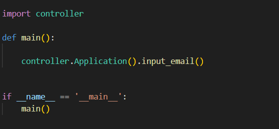

###### controller.py
The controller module, responsible for coordinating the interaction between the model and the view.

Functionality:
    Import the model and view modules.
    Application class:
        save_email method:
            Create an instance of the Email class to validate whether the email address is valid.
            If valid, call the FileIO.add_email method to save the address to a file.
            Call the CLI.save_email method to display a success message to the user.
            If invalid, catch the ValueError exception and call the CLI.invalid_email method to display an error message to the user.
        input_email method:
            Use the CLI.input_email method to get the email address from the user.
            If the user inputs an empty string, exit the loop.
            Otherwise, call the save_email method to process the input address.

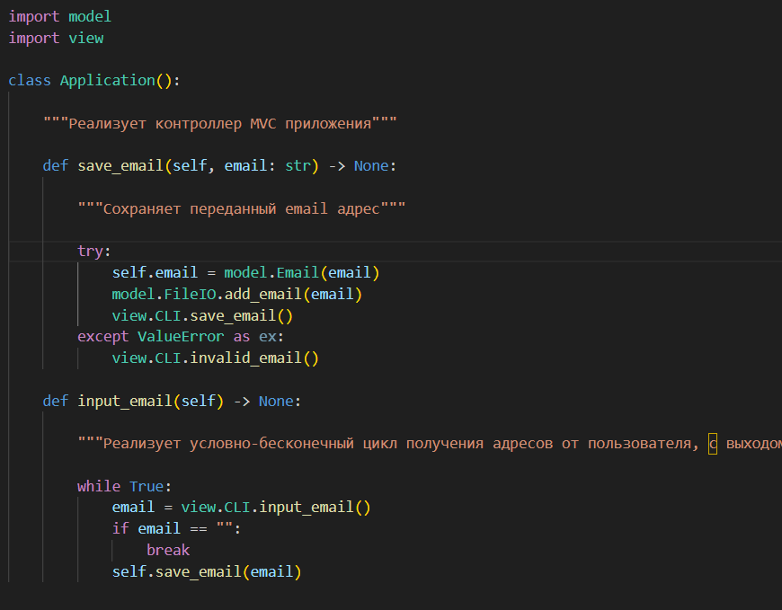

###### model.py
The model module, responsible for data processing and storage.

Functionality:
    Email class:
        Use a regular expression to validate whether the email address conforms to the standard format.
        If the address is valid, store it in the private attribute __email.
        If invalid, raise a ValueError exception.
    FileIO class:
        Provide the static method add_email to append the email address to the specified file.
        The default save path is the emails.txt file in the program's running directory.

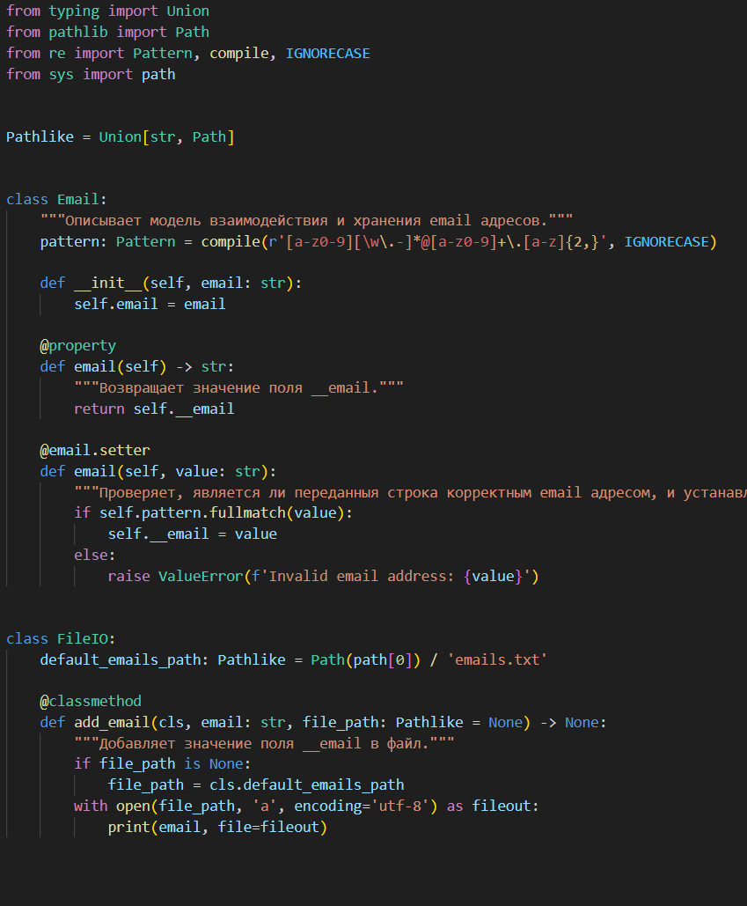

###### view.py
The view module, responsible for user interaction.

Functionality:
    Provide static methods for user interaction:
        input_email: Get the email address from standard input.
        invalid_email: Display an invalid address message to the user.
        save_email: Display a successful save message to the user.

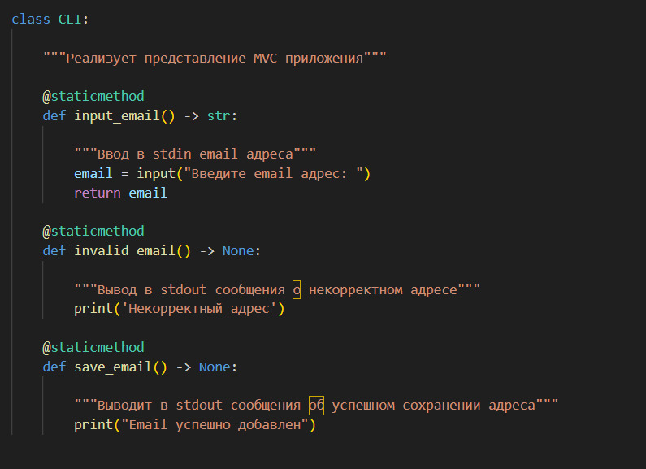
---

1.Enter an email address


2.Display validation results


---
<!--2023.09.10文件 by 刘兴发 -->


<!--2023.10.15文件 by 刘兴发 -->
<!--2023.10.15文件 #HW2023.10.15.1 by 刘兴发 -->
### Tasks, functions, and usage methods under document 2023.10.15:

#### Database installation and configuration
##### Software Installation
For Windows OS, download the MySQL Installer package:
[MySQL :: Download MySQL Installer](https://dev.mysql.com/downloads/installer/) 

Run the MySQL Installer package.
Perform installation and configuration of components according to the recommendations in the provided video tutorial.

For other operating systems, download the individual components:
[MySQL :: MySQL Community Downloads](https://dev.mysql.com/downloads/) 

- MySQL Community Server
- MySQL Shell
- MySQL Workbench

Install the components according to the requirements of your operating system. Installation instructions:
[MySQL :: MySQL 8.0 Reference Manual :: 2 Installing MySQL](https://dev.mysql.com/doc/refman/8.0/en/installing.html) 

Configuration options are also described in the video tutorial.

To test functionality, execute the following commands sequentially in the MySQL Shell client application (replace with your own port number if changed):
```sql

\connect root@localhost:3306
\sql
show databases;
```
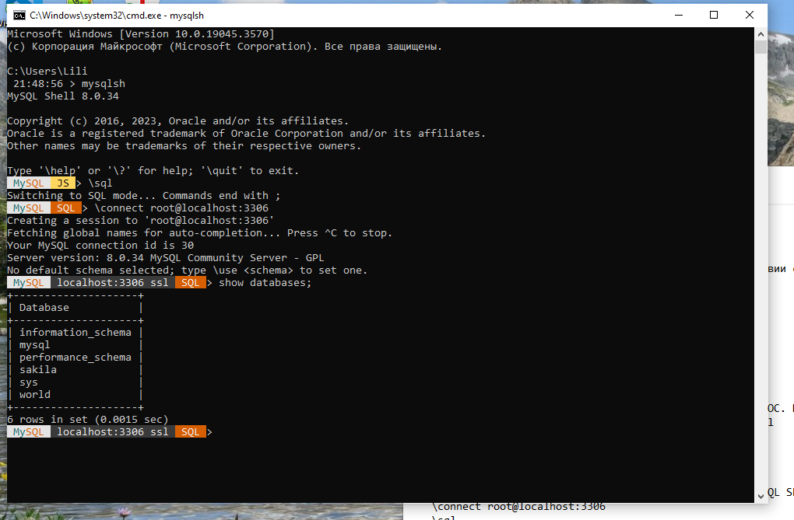
<!--2023.10.15文件 #HW2023.10.15.1 by 刘兴发 -->


<!--2023.10.15文件 #HW2023.10.15.2 by 刘兴发 -->
### Tasks, functions, and usage methods under document 2023.10.15:
### Music Collection Management System

A database system for managing a music collection, supporting information management for artists, music albums, songs, genres, and publishers.

#### Features
-  Manage artist information
-  Manage music album information
-  Manage song information
-  Manage music genres
-  Manage publishers
-  Database design and modeling

####  Getting Started

##### 1. Install MySQL
- **Windows**: Download and install MySQL Installer:
  [MySQL :: Download MySQL Installer](https://dev.mysql.com/downloads/installer/)
- **Other Operating Systems**: Download and install MySQL Community Edition:
  [MySQL :: MySQL Community Downloads](https://dev.mysql.com/downloads/)

##### 2. Create Database and Tables
Run the following SQL script to create the database and tables:

```sql
-- Create database
CREATE DATABASE mus_library;

-- Use database
USE mus_library;

-- Create tables
create table styles (
    id tinyint unsigned primary key auto_increment,
    style varchar(50) not null unique
);

create table performers (
    id smallint unsigned primary key auto_increment,
    performer varchar(100) not null unique
);

create table publishers (
    id smallint unsigned primary key auto_increment,
    publisher varchar(100) not null unique,
    country varchar(50) not null
);

create table collections (
    id smallint unsigned primary key auto_increment,
    collection varchar(100) not null unique,
    performer_id smallint unsigned not null,
    `date` year,
    style_id tinyint unsigned not null,
    publisher_id smallint unsigned not null,
    foreign key (performer_id) references performers (id),
    foreign key (style_id) references styles (id)  ,
  foreign key (publisher_id) references publishers (id)
);

create table songs (
  id int unsigned primary key auto_increment,
  song varchar(100) not null,
  performer_id smallint unsigned not null,
  collection_id smallint unsigned not null,
    style_id tinyint unsigned not null,
  duration time not null,
    foreign key (performer_id) references performers (id),
  foreign key (collection_id) references collections (id),
  foreign key (style_id) references styles (id)
);

```

3. Database Modeling
Use a database modeling tool (such as MySQL Workbench or dbdiagram.io) to create a database diagram and save it as a JPG or PNG image file named 2.1.

4. Save SQL Script
Save the above SQL script to a file named 2.2.sql.

####  Project Structure
        mus_library/
        ├── 2.1.png          # Database diagram
        ├── 2.2.sql          # SQL script
        └── README.md

#### Primary Function and Screenshot
1. Database Diagram

2. SQL Script
Saved as 2.2.sql file.

#### DESCRIPTION
Database Diagram: Created using dbdiagram.io or MySQL Workbench.
SQL Script: Contains DDL queries to create the database and tables.
<!--2023.10.15文件 #HW2023.10.15.2 by 刘兴发 -->

<!-- by 裴河权 -->
## 📮 Project Main Features Description and Screenshots

### Tasks, Functions, and Usage Methods under the 2023.08.27/Files directory:

1. **File System Management - Files and Folders**
   *Functions:*
   - This file contains the File class and Folder class, used to simulate file and folder management operations.
   - The File class represents a file, including functions to get the file extension, path, etc.
   - The Folder class represents a folder, supporting adding files and listing the contents of the folder.

   *Parameters:*
   - File class:
     name: File name (string type).
     dir: Directory path where the file is located (string type).
   - Folder class:
     elements: List of files or folders contained in the folder (list type).

   *Return values:*
   - File class:
     extension(): Returns the file's extension (string type).
     ls(): Returns the full path of the file (string type).
   - Folder class:
     ls(): Returns a list of paths of all files and folders in the directory (list type).

   *Test method as follows:*
   ```python
   file1 = File(name="example.txt", dir="C:/Documents")
   print(file1.extension())  # Output: txt
   print(file1.ls())         # Output: C:/Documents/example.txt
   
   folder = Folder([file1])
   folder.add_elements(File(name="example2.txt", dir="C:/Documents"))
   for obj in folder:
       print(obj.ls())  # Output all file paths in the folder
   ```

   *Test result:*
   txt
   C:/Documents/example.txt
   C:/Documents/example.txt
   C:/Documents/example2.txt

2. **Random Data Generation and Command Operations**
   *Functions:*
   - Generate random strings and numbers for test data, and support command execution, undo, and redo functions.

   *Parameters:*
   - TestCase class:
     messages: List of randomly generated message strings.
     numbers: List containing randomly generated numbers, length between 4 and 6 digits.
   - TestCommand class:
     operation: Type of operation (e.g., print message or number).
     account: The test account object executing the operation.

   *Return values:*
   - TestCase class: No return value, only used to generate data.
   - TestCommand class:
     execute(): Executes the specified operation.
     undo(): Undoes the last operation.
     re_undo(): Redoes the last undone operation.

   *Test method as follows:*
   ```python
   test = TestCase()
   c1 = TestCommand(test, Operation.PRINT_MSG)
   c1.execute()  # Execute print message operation
   c1.undo()     # Undo operation
   c1.re_undo()  # Redo operation
   ```

   *Test result:*
   Operation execution: Print message
   Undo operation: Print message
   Redo operation: Print message

3. **ClassBuilder-Dynamic Class Builder**
   *Functions:*
   - Dynamically generate Python classes, and allow adding instance attributes and class-level attributes.

   *Parameters:*
   - class_name: Name of the class (string).
   - name: Name of the attribute (string).
   - value: Value of the attribute (any type).

   *Return values:*
   - ClassBuilder class:
     add_inst_attr(): Returns itself, supports chain calls.
     add_cls_field(): Returns itself, supports chain calls.
     __str__(): Returns a string representation of the class.

   *Test method as follows:*
   ```python
   cb = ClassBuilder('Person').add_inst_attr('name', 'Liiya').add_inst_attr('age', 33)
   print(cb)
   ```

   *Test result:*
   

4. **HTMLTag Builder**
   *Functions:*
   - Used to generate HTML tags, supporting nested tags and sibling tags.

   *Parameters:*
   - name: Tag name (string, e.g., div, p).
   - value: Tag content or attribute (string).
   - style: Tag style (string).

   *Return value:*
   - Returns an HTMLTag object, used for chainable tag construction.

   *Test method as follows:*
   ```python
   root = HTMLBuilder('div')
   div = HTMLTag.create('div', '500px', '500px')
   div.sibling('p', 'Menu').nested('ul')
       .sibling('li', 'File').sibling('li', 'Edit')
   div.build()
   ```

   *Test result:*
   

5. **Resume Generator (CVBuilder)**
   *Functions:*
   - Used to generate HTML content for personal resumes.

   *Parameters:*
   - name: Personal name (string).
   - age: Personal age (integer).
   - field_of_employment: Employment field (string).

   *Return value:*
   - Returns the generated HTML resume code (string).

   *Test method as follows:*
   ```python
   cv = CVBuilder('Liliya Martynova', 33, 'Web Developer')
   cv.add_education('University of Python', 'Developer', '2022')
   cv.add_project('Portfolio', 'portfolio.com')
   cv.build()
   ```

   *Test result:*
   

6. **Operation Commands and Logging - Command Execution and Undo**
   *Functions:*
   - Executes commands, supports undo and redo, and maintains operation records.

   *Parameters:*
   - TestCommand class:
     operation: Type of operation (e.g., print message or number).
     account: The object executing the operation (TestCase).

   *Return values:*
   - TestCommand class:
     execute(): Executes the command.
     undo(): Undoes the command.
     re_undo(): Redoes the command.

   *Test method as follows:*
   ```python
   test = TestCase()
   c1 = TestCommand(test, Operation.PRINT_MSG)
   c1.execute()  # Execute command
   c1.undo()     # Undo command
   c1.re_undo()  # Redo command
   ```

   *Test result:*
   

7. **File System Management - Files and Folders**
   *Functions:*
   - Simulate file system operations, including getting file extensions, listing directory contents, etc.

   *Parameters:*
   - name: Name of the file or folder (string).
   - dir_path: Path where the file or folder is located (string).

   *Return values:*
   - File class:
     extension(): Returns the file extension (string).
     ls(): Returns the file path (string).
   - Folder class:
     ls(): Lists the contents of the folder (list).

   *Test method as follows:*
   ```python
   file1 = File(name="example.txt", dir="C:/Documents")
   print(file1.extension())  # Output: txt
   print(file1.ls())         # Output: C:/Documents/example.txt
   
   folder = Folder([file1])
   folder.add_elements(File(name="example2.txt", dir="C:/Documents"))
   for obj in folder:
       print(obj.ls())  # Output all file paths in the folder
   ```

   *Test result:*
   

### 2023.09.03/files tasks, functions, and usage methods:
1. **International Chess Game Manager**
    *Function:*   
    - Implements an international chess game management module, mainly responsible for move recording and game state management.

    *Core Class Descriptions:*   
    - Turn Class:
      Function: Stores all key information of a single move
      Parameters:
      piece: the moving piece object
      start_square: starting position coordinate
      end_square: target position coordinate
      turn_count: turn counter
    - Game Class:
      Function: Manages the entire game lifecycle
      Main methods:
      move(start_square, end_square):
      Parameters: two coordinate strings (e.g., "a2", "a4")
      Executes: moves a piece and records the move
      history_turns():
      Prints all historical moves
      rollback_game(turn_count):
      Parameters: target turn number
      Function: Roll back the game to the specified turn state

    *Return Values:*
    - File Class:
      extension(): Returns the file extension (string type).
      ls(): Returns the file path (string type).
    - Folder Class:
      ls(): Lists the contents of the folder (list type).

    *Test Method as follows:*  
    ```python
    game = Game()
    game.move('a1','a3')
    game.move('b1','b3')
    game.move('c1','c3')
    ```
    *Test Result:*  
    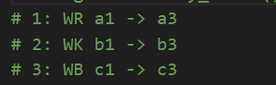

2. **Chessboard Class Structure Analysis (chess.png content)**

    1. Chessboard (Main class)
      Core functions:
      __init__(): Initialize an empty board
      __post_init__(): Set up the initial piece layout
      __rank(): Get all squares in a specified rank
      __getitem__(): Support multiple coordinate access methods
      Key features:
      Manages board columns through nested File classes
      Supports board["a1"] and board["a"][1] access methods
      Automatically initializes the standard opening layout

    2. File (Board column)
      Constructor:
      __init__(file: str, start_color: SquareColor)
      Parameters:
      file: column letter (a-h)
      start_color: starting square color of the column

    3. Square (Board square)
      Properties:
      color: SquareColor (LIGHT/DARK)
      file: column label (a-h)
      rank: row label (1-8)
      piece: current piece on the square (optional)
      Methods:
      __repr__(): developer debugging representation
      __str__(): returns coordinate string (e.g., "a1")

    4. Piece (Chess piece)
      Key properties:
      color: piece color (WHITE/BLACK)
      kind: piece type (6 types)
      square: current position square
      removed: whether it has been captured
      Core methods:
      move(end_square): execute movement and capture logic
      __del__(): automatically handles piece removal
      String representation:
      __str__(): short form (e.g., "WP" for White Pawn)
      __repr__(): full name (e.g., "White Pawn")

    5. Enumeration types:
      SquareColor:
      LIGHT: Light-colored square
      DARK: Dark-colored square
      PieceColor:
      WHITE: White side
      BLACK: Black side
      PieceKind:
      6 standard chess pieces: King, Queen, Rook, Bishop, Knight, Pawn

3. **Core Chess Engine**
    *Function:*   
    - Implements core data structures and basic rules of chess.

    *Core Components:*   
    - Enum types:
      SquareColor: board square color (LIGHT/DARK)
      PieceColor: piece color (WHITE/BLACK)
      PieceKind: piece type (6 types)
    - Piece Class:
      Function: represents a single chess piece
      Main methods:
      move(end_square): executes move and capture logic
      Automatically handles captured pieces removal
    - Square Class:
      Function: represents a single board square
      Properties: color, coordinate, current piece
    - Chessboard Class:
      Function: complete board representation
      Features:
      Supports multiple coordinate access methods ("a1" or separate row/column)
      Automatically initializes standard opening layout
      Nested File classes manage board columns

4. **Font Files**
    DejaVuSans.ttf
    FreeSerif.ttf
    Quivira.ttf
    Type: TrueType fonts
    Uses:
      Displaying board coordinate labels
      Text rendering in game interface
      Possibly for displaying special chess symbols (e.g., piece icons)
    Features:
      DejaVuSans: Sans-serif font, suitable for interface display
      FreeSerif: Serif font, suitable for formal text
      Quivira: Contains many Unicode symbols, possibly for showing chess piece graphics
   <!-- by 裴河权 -->

## 📮 Project Main Function Description and Screenshots
<!-- by 钟章鸿 -->
### Tasks and Instructions for 2023.07.02 Files

1. Implement the Tetrahedron Class

    Functionality:
        Describes the geometric properties of a regular tetrahedron (all faces are equilateral triangles) and provides methods to calculate its surface area and volume.
    Parameters:
        Parameter 1: Side length, type: float.
    Methods:
        surface():
            Function: Calculates the surface area of the tetrahedron. Returns a float.
        volume():
            Function: Calculates the volume of the tetrahedron. Returns a float.
    Test Method & Result:
        

2. Implement the PowerMeter Class
    Functionality:
        Simulates a dual-tariff electricity meter (i.e., different unit prices depending on the time period).
    Parameters:
        tariff1: Unit price for rate 1 (default: 4.35).
        tariff2: Unit price for rate 2 (default: 3.21).
        tariff2_starts: Start time of rate 2 (default: 23:00).
        tariff2_ends: End time of rate 2 (default: 07:00).
    Methods:
        __repr__():
            Function: Returns the string representation of the power meter, showing the accumulated electricity usage (in kWh).
        __str__():
            Function: Returns the string representation of the power meter, showing the current month's and today's accumulated electricity cost.
        meter(power):
            Function: Accepts a usage value (power), calculates the corresponding electricity cost, updates the meter's status, and returns the cost of this usage (type: Decimal).
    Test Method:
        ```python
            pm1 = PowerMeter()
            pm1.meter(5)
        ```
    Test Result:
        

3. Implement the ChessKing Class

    Functionality:
        Describes the behavior and rules of the King piece in international chess.

    Methods:

        __repr__():
            Function: Returns the string representation of the King piece, used for debugging.
    
        __str__():
            Function: Returns the string representation of the King piece, used for printing.
    
        is_turn_valid(new_square):
            Function: Checks whether a move from the current square to the new square is valid for a King. Returns True if the move is legal, False otherwise.
    
        turn(new_square):
            Function: Performs the move from the current square to the target square.

    Test Method & Result:
        

4. Implement the CountableNouns Class

    Functionality:
        Handles the grammatical changes of countable nouns in Russian based on numeric context. In Russian, noun forms change depending on the number.

    Methods:

        pick(number, word):
            Function: Based on the input number and base form of the noun, returns the correct noun form.
        
        save_words(word1):
            Function: Through interactive input, adds new noun forms to the internal words dictionary and words.csv file. If word1 is not provided, prompts the user for input.

    Test Method & Result:
        

### Tasks, Functions, and Usage under the Folder 2023.07.30:
1. Implement the Point, Line, and Polygon Classes

    Point Class

        Functionality:
    
            Stores coordinates of a point (x and y).
    
            Provides read-only attributes.
    
            Supports comparison and string representation.
    
        Parameters:
    
            x: float, y: float
    
        Methods:
    
            __eq__(): Compares two points (equal if both x and y are equal).
    
            __str__() and __repr__(): Returns the string representation of the point.

    Line Class

        Functionality:
             a line segment defined by two points (start and end), supports length calculation and dynamic updating of endpoints.
    
        Parameters:
    
            start: Point
    
            end: Point
    
        Methods:
    
            length_calc(): Calculates the distance between the two points (i.e., the length of the line segment).
    
            start(), end(): Endpoints can be dynamically updated but must be assigned as Point objects; otherwise, a TypeError is raised.
    
            __str__() and __repr__(): Returns the string representation of the line.

    Polygon Class

        Functionality:
            Represents a polygon composed of multiple line segments. Supports checking whether the polygon is closed and calculating its perimeter.
    
        Methods:
    
            is_closed():
                Function: 
                    Checks whether the polygon is closed:
                    Whether the first and last segments are connected.
                    Whether each segment’s endpoint connects to the next segment’s start point.
    
            perimeter():
                Function: 
                    Calculates the total perimeter (sum of all segment lengths).
                    If the polygon is not closed, raises a ValueError.

    Test Method & Result:
        
<!-- by 钟章鸿 -->

<!-- by 陈万程-->

### The main functionalities and screenshots of the programs in the directory '2023.04.23'

- 1.py

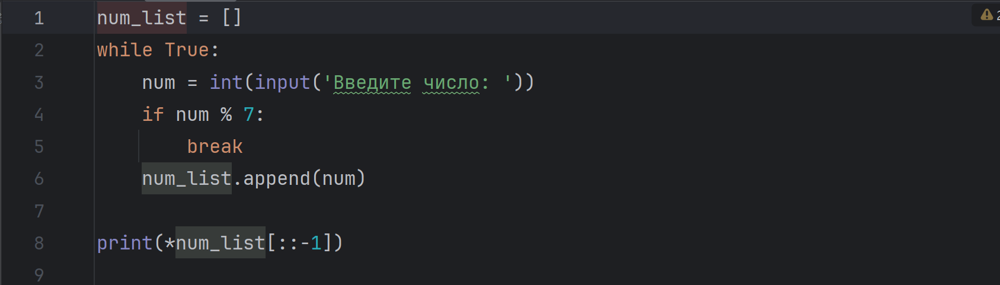

This program is used to record the numbers input by the user that can be divisible by 7, and then output these numbers in reverse order. To use this program, we need to input numbers that are divisible by 7. When a number that is not divisible by 7 is input, the program will output in reverse order of the numbers that are divisible by 7 input by the user and end the program

- 2.py

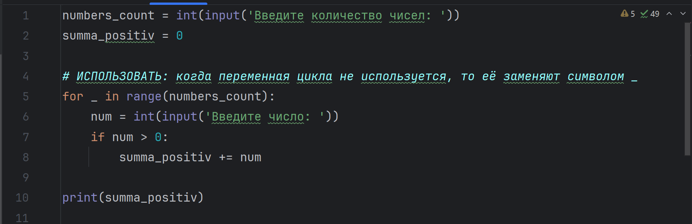

This program is used to calculate the sum of the positive numbers of the input. If we want to use this program, we need to input the total number of numbers to be input, and then input the integers in sequence. After input, the program will provide the sum of the positive numbers in the numbers input by the user

- 3.py

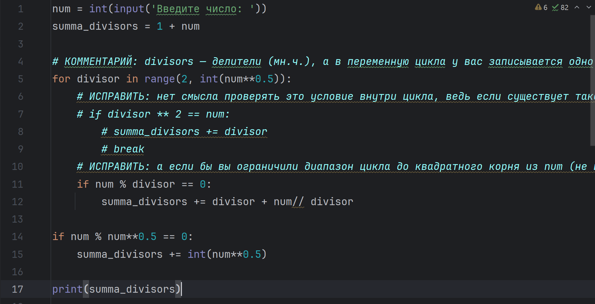

This program is used to calculate the sum of all divisors of a number. When using this program, input a positive integer, and then the program will output the sum of all divisors of that number

- 4.py

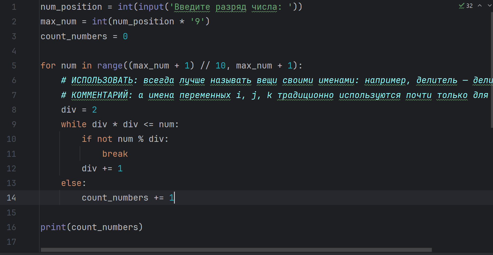

This program is used to calculate the total number of prime numbers in the specified number of digits. When using this program, users need to input an integer indicating the number of digits to be processed (for example, 3 represents three digits), and then the program will output an integer indicating the number of prime numbers within the digit range.

- 5.py

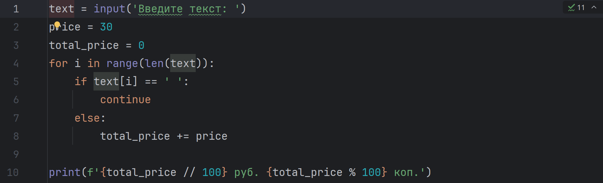

This program is used to calculate the total cost of a piece of text. When using this program, users need to input a piece of text, and then the program will output the total cost of this text

- 6.py

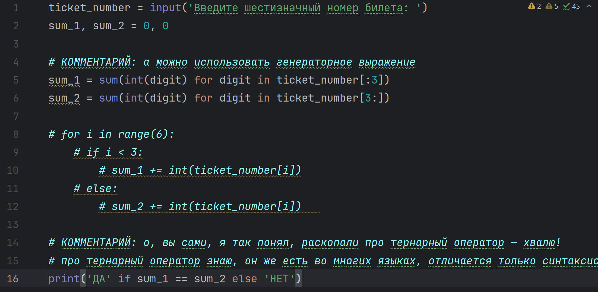

This program is used to determine whether a six-digit ticket is a "lucky ticket" (the sum of the first three digits is equal to the sum of the last three digits). When using this program, the user needs to input a six-digit number, and then the program will output "Yes" or "No".

- 7.py

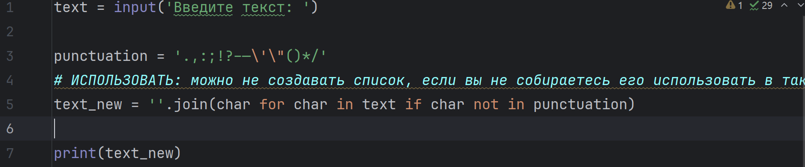

This program is used to remove all the specified punctuation marks in the text input by the user. When using this program, the user needs to input a string, and then the program will output a new string without the specified symbol

- 8.py

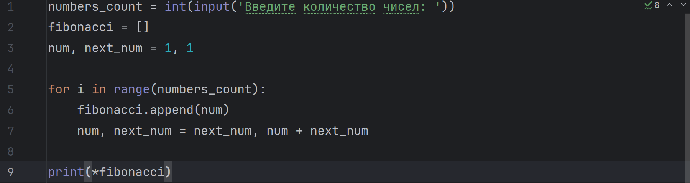

This program is used to generate the Fibonacci sequence of the specified length. When using this program, users need to input a positive integer representing the length of the Fibonacci sequence to be output. Then the program will output a Fibonacci sequence separated by Spaces

### The main functions and screenshots of the program in the directory '2023.04.30'

- 1.py

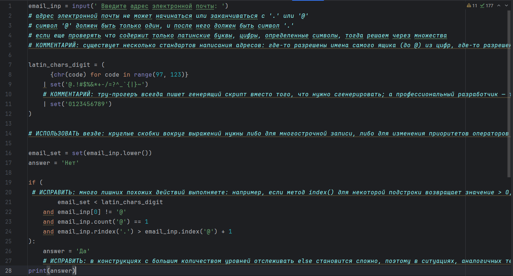

This program is used to verify whether the format of the email address entered by the user complies with some basic rules. When using this program, enter an email address, and then the program will output "Yes" or "No" to indicate whether it is an email address that conforms to the rules

- 2.py

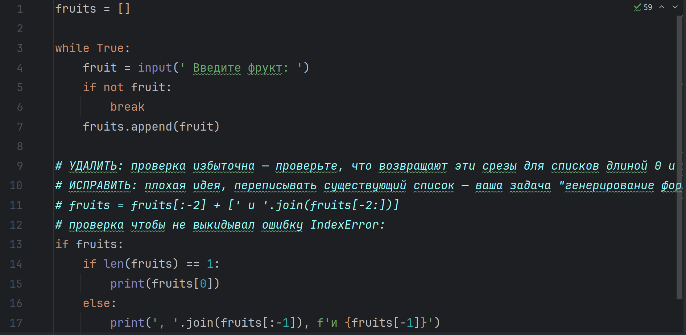

This program is used to collect the fruit names input by users and output them in natural language. When using this program, you need to enter the fruit names as prompted. Pressing Enter directly indicates the end of the input, and then the program will output these fruit names in natural language.

- 3.py

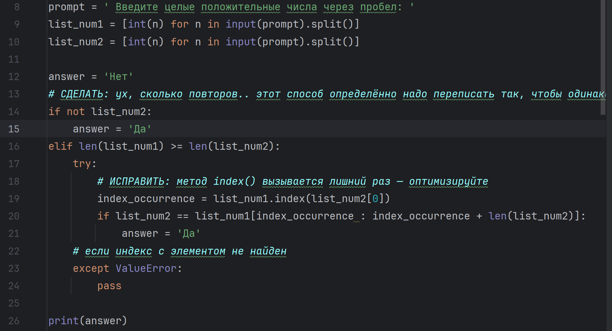

This program is used to determine whether the second list (' list_num2 ') input by the user is a consecutive subsequence of the first list (' list_num1 '). When using this program, users need to input two lists of positive integers separated by Spaces. Then the program will return 'Yes' or' No ', indicating whether the second list is a consecutive subsequence of the first list

- 4.py

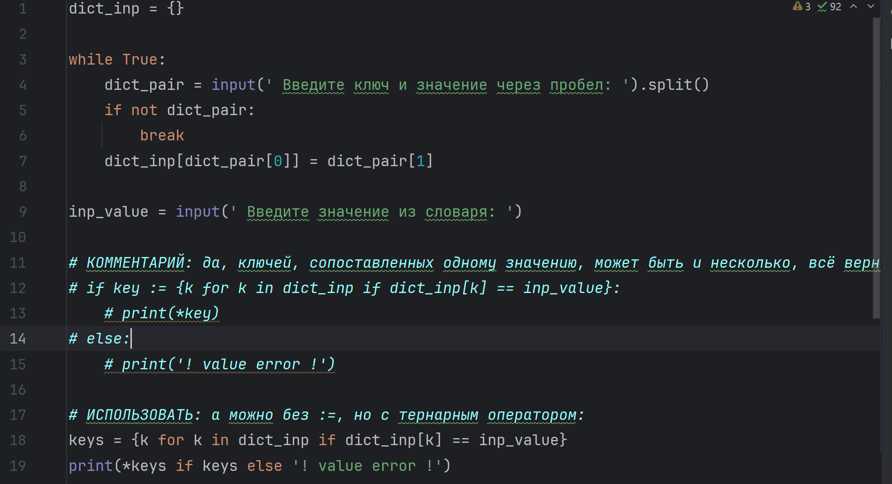

This program is used to find the key corresponding to the specified value in the key-value pairs input by the user. When using this program, users need to loop through multiple key-value pairs (with Spaces as intervals). Pressing Enter directly indicates the end of entering the key-value pairs. Then, enter the value you want to search for, and the program will output all the corresponding keys in the dictionary based on the values entered by the user. If the value does not exist, display an error message.	

-  5.py

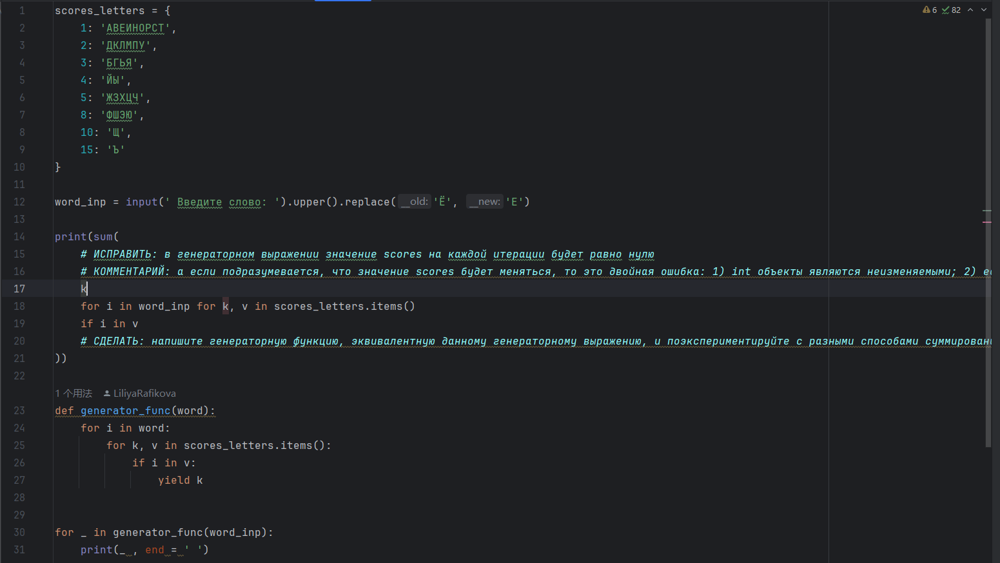

This program is used to calculate the total score corresponding to each letter (Russian letter) in the word input by the user (based on the given letter score dictionary). When using this program, users need to input one or more Russian words, and then the program will output the total score of the words as well as the score of each letter in the words

- 6.py

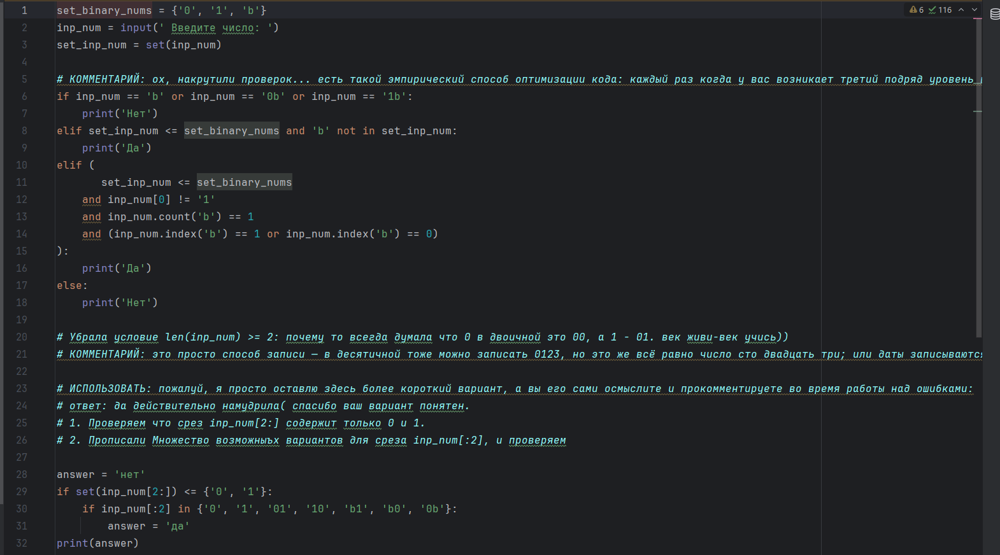

This program is used to check whether the string input by the user meets the specific binary number format requirements. When using this program, the user needs to input a string (indicating possible strings), and then the program will output "Yes" or "No" to indicate whether the string meets the specific binary number format requirements

- 7.py

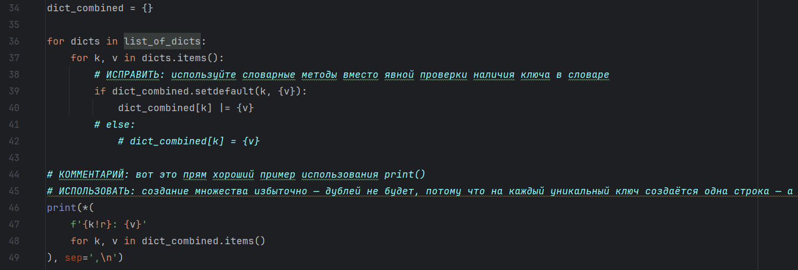

This program is used to merge cities and their corresponding values from multiple dictionaries into a new dictionary, ensuring that all the values of each city are collected as a unique set of values. After running the program, it will merge all the cities and their values in the prepared dictionaries into a new dictionary and print it out in a specific format

- 8.py

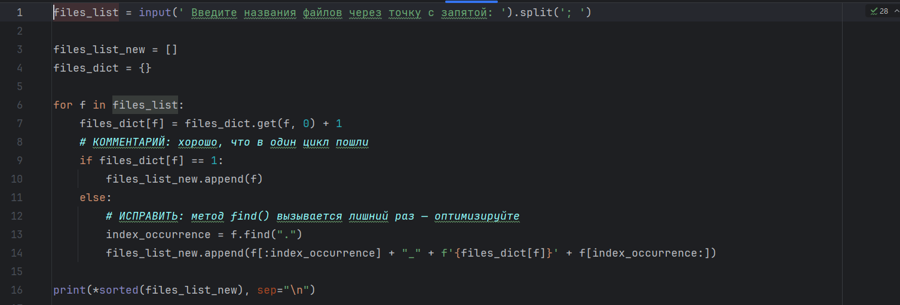

This program is used to handle a set of file names input by the user to ensure that the file names are unique when outputting. When using this program, users are required to input '; A list of separated file names. If there are duplicate file names, a sequence number will be added after the main file name, and the extension will remain unchanged. After processing, the processed file names will be output in alphabetical order, one per line.

<!-- by 陈万程-->


<!-- by 郑锐滨（For the folder 2023.05.28）-->

# Python Utilities and Learning Toolkit

## Description

This project is a comprehensive collection of Python scripts and utility modules designed for both learning and practical use. It covers a wide range of topics, including file and directory operations, terminal message formatting, dynamic module importing, text search with context extraction, function call logging, and SI unit conversion. The project provides both main implementations and reference versions (`*_ref.py`) for comparative study and deeper understanding of different programming approaches.

The `data` directory contains various supporting files, such as quiz question banks, configuration files, historical texts, images, and archives, enabling batch text processing, configuration management, and logging.

## Features

- **File and Directory Operations**: Quickly list all files in a directory for management and batch processing.
- **Terminal Message Formatting**: Beautify and center important messages for enhanced terminal interaction.
- **Dynamic Module Importing**: Load external Python files or configuration files at runtime for flexible program behavior.
- **Text Search with Context Extraction**: Search for keywords in multiple text files and extract surrounding context for analysis.
- **Function Call Logging**: Automatically log function calls, parameters, return values, and exceptions for debugging and tracing.
- **SI Unit Conversion**: Convert numbers to appropriate SI prefixes for scientific computing and display.
- **Data and Configuration Management**: Use files like `vars.py` and `conf.py` for quiz constants and application settings.

## Installation

1. **Clone or download** this repository, ensuring the `data` directory and its contents are intact.
2. Make sure you have Python 3.10 or higher installed.

## Usage

This project consists of several independent Python scripts, each demonstrating a specific utility or programming technique. You can run each script directly from the command line, or import and use the utility functions in your own code.

### 1. List Files in a Directory

- **Script:** `1.py` or `1_ref.py`
- **How to use:**
  ```python
  from 1 import list_files
  print(list_files(r'./data'))
  # Output: ('7MD9i.chm', 'conf.py', 'E3ln1.txt', ...)
  ```
  Or run interactively:
  ```bash
  python -i 1.py
  >>> list_files(r'./data')
  ```

### 2. Beautify and Print Important Messages

- **Script:** `2.py` or `2_ref.py`
- **How to use:**
  ```bash
  python 2.py
  ```
  The script will prompt you to enter a message, then print it in a decorated, centered box in the terminal.
  Example:
  ```
   Введите текст: PROGRAM TITLE

   #==============================#
   #                              #
   #        PROGRAM TITLE         #
   #                              #
   #==============================#
  ```

- **Direct function usage:**
  ```python
  from utils import important_message
  print(important_message('Hello World!'))
  ```

### 3. Dynamically Import a File

- **Script:** `3.py` or `3_ref.py`
- **How to use:**
  ```bash
  python 3.py
  ```
  The script will prompt for a file path. Enter the path to a Python file (e.g., `./data/conf.py`). If the file exists, it will be copied and imported as a module.

### 4. Search for Keywords in Text Files

- **Script:** `4.py` or `4_ref.py`
- **How to use:**
  ```python
  from 4 import search_context
  results = search_context('keyword', 'another', context=1)
  for item in results:
      print(item)
  ```
  - Searches all `.txt` files in the `data` directory for lines containing the given keywords.
  - Returns a list of dictionaries with filename, line number, context, and matched text.

### 5. Function Call Logging

- **Script:** `5.py` or `5_ref.py`
- **How to use:**
  ```python
  from 5 import logger
  @logger
  def add(a, b):
      return a + b

  add(1, 2)
  # Each call is logged to data/function_calls.log
  ```

### 6. SI Unit Conversion

- **Script:** `si_unit.py`
- **How to use:**
  ```python
  from si_unit import SIUnit
  v = SIUnit(1500, 'm')
  print(v)           # Output: 1.5 km
  print(v.target(0)) # Output: 1500 m
  ```

### Notes

- Some scripts require user input in the terminal.
- Some scripts depend on files in the `data` directory (e.g., `conf.py`, `.txt` files).
- All utility functions can be imported and reused in your own Python projects.

## Requirements or Dependencies

- **Python Version**: 3.10 or higher recommended.
- **Dependencies**: Only Python standard library modules are used (e.g., `pathlib`, `shutil`, `importlib`, `sys`, `datetime`). No third-party packages required.

## File Structure

```
2023.05.28/
│
├── 1.py, 1_ref.py           # List files in a directory
├── 2.py, 2_ref.py           # Beautify and print important messages
├── 3.py, 3_ref.py           # Prompt for file path and dynamically import modules
├── 4.py, 4_ref.py           # Search for keywords in text files with context
├── 5.py, 5_ref.py           # Function call logging decorators
├── si_unit.py               # SI unit conversion and formatting
├── utils.py, utils_ref.py   # Utility functions (message formatting, dynamic import, etc.)
├── 20230528-markdown.md     # Detailed documentation (in Chinese)
├── # HW 2023.05.28.txt      # Assignment and usage instructions (in Russian)
│
└── data/
    ├── vars.py              # Constants and settings for the quiz game
    ├── conf.py              # Example configuration dictionary
    ├── questions.quiz       # Quiz question bank
    ├── *.txt                # Text files for search and analysis
    ├── function_calls.log   # Log file for function calls
    ├── *.chm, *.docx, *.jpg, *.zip # Miscellaneous data files
    ├── c14KE/, mXbd9/       # Subdirectories with additional data files
    └── __pycache__/         # Python cache files (auto-generated)
```

## License

This project is intended for educational and practical use. Please refer to the repository or contact the author for licensing details. 

<!-- by 郑锐滨（Ended for the folder on 2023.05.28）-->

<!-- by 郑锐滨（For the folder 2023.05.28）-->

# Recursive Algorithms and Data Processing Utilities

## Description
This project is a collection of Python scripts and data files designed for practicing and demonstrating recursive algorithms and data structure processing. The main focus is on recursive operations over nested data (such as lists, dictionaries, and trees), as well as utilities for generating and analyzing structured data, including random tree generation and batch name processing.

## Features
- Recursive calculation of the product of all numbers in arbitrarily nested iterables (lists, dictionaries, tuples, etc.)
- Recursive counting of leaf nodes in arbitrarily nested tree-like lists
- Recursive generation of random tree structures with variable depth and branching
- Utilities for batch processing and generation of names and personal data (using provided `.txt` files)
- All scripts use only the Python standard library (no third-party dependencies)

## Installation
1. Ensure you have Python 3.8 or higher installed on your system.
2. Clone or download this repository to your local machine.
3. No additional installation steps are required, as all scripts use only the standard library.

## Usage
### 1. Recursive Product Calculation (`1.1.py`)
Calculates the product of all numbers in any nested iterable structure.

**Example:**
```python
from 1.1 import product

print(product([1, 2, 3]))  # 6.0
print(product({'a': 2, 'b': [3, 4]}))  # 24.0
print(product([10, 2, [1.5, [10, 2]]]))  # 600.0
```

### 2. Tree Leaf Counting (`1.2.py`)
Counts the number of leaf nodes (non-list elements) in any nested list (tree structure).

**Example:**
```python
from 1.2 import tree_leaves

tree = [[['leaf', 'leaf'], 'leaf'], 'leaf']
print(tree_leaves(tree))  # 4
```

### 3. Random Tree Generation (`1.3.py`)
Recursively generates a random tree structure (nested lists) with 'leaf' as the leaf node.

**Example:**
```python
from 1.3 import tree_generator

tree = tree_generator()
print(tree)
```

### 4. Name and Data Batch Processing
The `.txt` files (`женские_имена.txt`, `мужские_имена_отчества.txt`, `фамилии.txt`) contain lists of Russian female names, male names with patronymics, and surnames, respectively. These can be used for batch data generation or analysis in your own scripts.

## Requirements / Dependencies
- Python 3.8+
- No third-party packages required (standard library only)

## File Structure
```
2023.06.04/
├── 1.1.py                  # Recursive product calculation
├── 1.2.py                  # Recursive tree leaf counting
├── 1.3.py                  # Random tree structure generator
├── женские_имена.txt       # Russian female names
├── мужские_имена_отчества.txt # Russian male names and patronymics
├── фамилии.txt             # Russian surnames
├── 2023.06.04_readme.md    # Original project readme (in Chinese)
├── # HW 2023.06.04_1.txt   # Homework/task description 1
├── # HW 2023.06.04_2.txt   # Homework/task description 2
├── # HW 2023.06.04_3.txt   # Homework/task description 3
├── 3.1.png                 # Screenshot or image file
```

---

For more details, see the comments and docstrings in each script, and refer to the original Chinese readme for further explanations. 


<!-- by 郑锐滨（Ended for the folder on 2023.06.04）-->