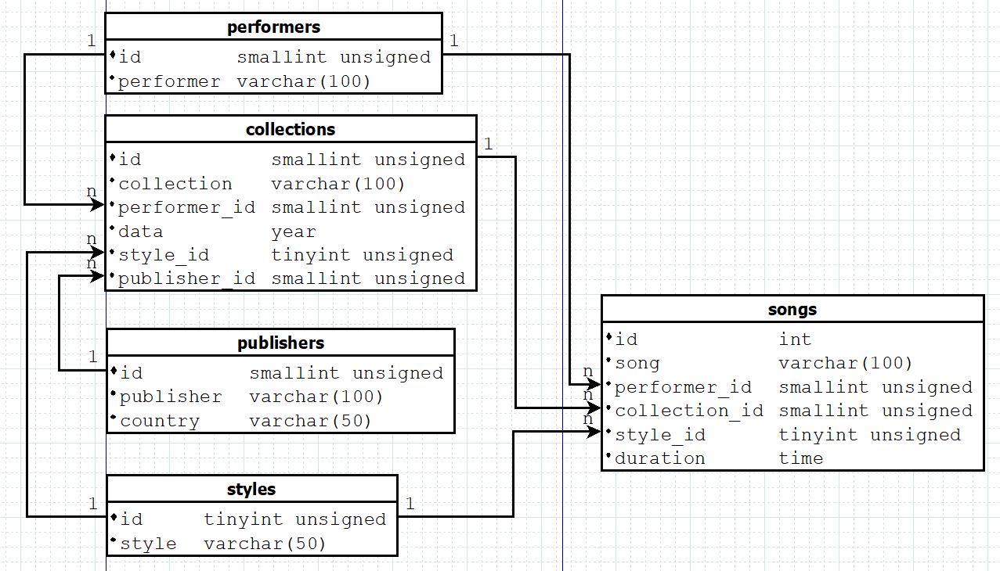

# Top-Python321
---

This is a collection of Python basic usage assignments where the teacher has arranged Python exercises for students, covering topics such as input/output operations, variables and data types, formatted output, conditional statements, loops, file handling and module imports, and function writing.

## ✨ Project Features

- 📝 Practice-Oriented  
    All tasks require students to write code themselves. This hands-on approach helps deepen their understanding and application of the Python programming language, effectively enhancing their coding skills.
- ✅ Gradual Difficulty Increase  
    Tasks start with basic input/output operations and variables, then progress to conditional statements and loops, and finally move on to function definitions, file operations, etc. This forms a learning path that gradually increases in difficulty.
- 💾 Comprehensive Knowledge Coverage  
    It covers many important aspects of Python programming, including but not limited to data types, control structures, functions, modules, file operations, exception handling, etc. This enables students to gain a comprehensive understanding and mastery of the Python programming language.
- 🎨 Feedback and Evaluation Mechanism  
    Students are asked to keep the output results of their code in the form of comments in the code files and report their assignment completion status in the designated "Журнал" service. This helps teachers evaluate and provide feedback on students' learning progress and outcomes.
- 🔑 Combined with Practical Applications  
    The tasks involve scenarios such as password strength checking, taxi fare calculation, and file operations, which are related to real-life or work situations. This enables students to apply their knowledge to practical problems.

## 🚀 Quick Start

### Clone the Project

```bash
git clone https://github.com/Glccccc/wuyanzu-group.git
cd wuyanzu-group
```

### Launch the Project
```bash  
cd wuyanzu-group/2023.04.09
python 1.py
python 2.py
...
```
The project will run in your local ```development environment```.
## 📦 Project Structure
```
wuyanzu-group/
├── 2023.04.09/
│   ├── # HW 2023.04.09.txt
│   ├── 1.py
│   ├── 2.py
│   ├── 3.py
│   ├── 4.py
│   └── 5.py
├── 2023.04.16/
├── 2023.04.23/
├── ...
└── README.md
```
## 📮 Project Main Function Description and Screenshots
<!-- by 管立超 -->
### Tasks and Instructions for 2023.05.14 Files

1. **Implement the strong_password Function**
    
    *Function:* Checks if a password is strong.
    
    *Parameters:*
    - Parameter 1: A required keyword parameter of type str representing the password.
    
    *Return Value:*
    - A bool. Returns True if the password meets the following conditions, otherwise False:
        - Minimum length of 8 characters.
        - Contains both uppercase and lowercase Latin letters.
        - Contains at least two numeric characters.
        - Contains at least one non-alphanumeric character.
    
    *Testing Method:*
    ```python
    strong_password('aA1!') == False  # Insufficient length
    strong_password('aA1!aA1!') == True  # Meets all conditions
    ```
    
    *Test Results:*  
    

2. **Implement the taxi_cost Function**
    
    *Function:* Calculates the taxi fare.
    
    *Parameters:*
    - Parameter 1: A required keyword parameter of type int representing the trip distance in meters.
    - Parameter 2: An optional keyword parameter of type int representing waiting time in minutes, defaulting to 0.
    
    *Return Value:*
    - Returns None if parameters are invalid (e.g., negative values).
    - Otherwise, calculates and returns the fare (as an integer) based on the rules:
        - Base fare is 80 rubles.
        - 6 rubles for every 150 meters.
        - 3 rubles for every minute of waiting.
        - If the trip distance is 0 meters (cancellation), a penalty of 80 rubles plus waiting time cost is added.
        - The final cost is mathematically rounded to the nearest integer.
    
    *Testing Method:*
    ```python
    taxi_cost(1500)
    ```
    
    *Test Results:*  
    

3. **Implement the numbers_strip Function**
    
    *Function:* Removes the n smallest and largest numbers from a list.
    
    *Parameters:*
    - Parameter 1: A required positional-keyword parameter, a list of floats.
    - Parameter 2: An optional positional-keyword parameter n, defaulting to 1, of type int.
    - Parameter 3: A strict keyword parameter of type bool, defaulting to False, to decide whether to return the modified original list or a new list.
    
    *Return Value:*
    - Returns the modified original list or a new list based on the requirements.
    
    *Testing Method:*
    ```python
    nums = [10, 20, 30, 40, 50, 60, 70]
    nums_test = numbers_strip(nums, 3, copy=True)
    nums_test
    ```
    
    *Test Results:*  
    

4. **Implement the countable_nouns Function**
    
    *Function:* Selects the appropriate Russian noun form based on the numeral.
    
    *Parameters:*
    - Parameter 1: A required parameter of type int representing the numeral.
    - Parameter 2: A required tuple parameter containing three str elements corresponding to the three forms of the noun.
    
    *Return Value:*
    - Returns the corresponding noun form based on the numeral rules.
    
    *Testing Method:*
    ```python
    countable_nouns(1, ("год", "года", "лет"))
    ```
    *Test Results:*  
    

5. **Implement the central_tendency Function**
    
    *Function:* Calculates the measures of central tendency for a set of numbers.
    
    *Parameters:*
    - Parameter 1: Positional parameter 1 of type float.
    - Parameter 2: Positional parameter 2 of type float.
    - Parameter 3: Variable number of positional parameters of type float.
    
    *Return Value:*
    - A dictionary containing the following key-value pairs:
        - 'median': Median (float).
        - 'arithmetic': Arithmetic mean (float).
        - 'geometric': Geometric mean (float).
        - 'harmonic': Harmonic mean (float).
    
    *Testing Method:*
    ```python
    central_tendency(1, 2, 3, 4)
    ```
    
    *Test Results:*  
    

6. **Implement the orth_triangle Function**
    
    *Function:* Calculates the third side of a right-angled triangle.
    
    *Parameters:*
    - Parameter 1: Side length of type int or float.
    - Parameter 2: Side length of type int or float.
    - Parameter 3: Hypotenuse of type int or float.  
    
    *Return Value:*
    - Returns the length of the third side (float) if the calculation is possible.
    - Returns None if the parameters are invalid.
    
    *Testing Method:*
    ```python
    orth_triangle(cath1=3, cath2=4)
    ```
    
    *Test Results:*  
    

### Tasks and Instructions for 2023.05.21 Files


<!--2023.09.10文件 by 刘兴发 -->
# 英文版的Readme.md示例

---

# Email Validator

A lightweight and easy-to-use command-line tool for validating email addresses and saving valid ones to a file.

## ✨ Features

- 📝 Verify if the entered email address is correct
- ✅ Save a valid email address to a file
- 💾 Data is saved in a local text file
- 🎨 Simple command-line interface, easy to use

## 🚀 Getting Started

### Clone the repository

```bash
git clone https://github.com/zaizai913/wuyanzu-group.git
cd Email Validator
```

### Install dependencies

```bash
pip install -r requirements.txt
```

### Run the app

```bash
python 1.py
```

The application will launch a command-line interface, prompting you to enter email addresses.

## 📦 Project Structure

```
EmailValidator/
├── model.py            # Data processing and storage model
├── view.py             # User interface logic
├── controller.py       # Business logic coordination
├── 1.py                # Entry point
└── README.md
```

## 📮 Primary function & Screenshot

## 1.py
This is the entry file of the program, responsible for launching the application.

Functionality:
    Import the controller module.
    In the main function, create an instance of the Application class and call its input_email method.
    Use if __name__ == '__main__': to ensure that the main function is executed only when this file is run directly.

## controller.py
The controller module, responsible for coordinating the interaction between the model and the view.

Functionality:
    Import the model and view modules.
    Application class:
        save_email method:
            Create an instance of the Email class to validate whether the email address is valid.
            If valid, call the FileIO.add_email method to save the address to a file.
            Call the CLI.save_email method to display a success message to the user.
            If invalid, catch the ValueError exception and call the CLI.invalid_email method to display an error message to the user.
        input_email method:
            Use the CLI.input_email method to get the email address from the user.
            If the user inputs an empty string, exit the loop.
            Otherwise, call the save_email method to process the input address.

## model.py
The model module, responsible for data processing and storage.

Functionality:
    Email class:
        Use a regular expression to validate whether the email address conforms to the standard format.
        If the address is valid, store it in the private attribute __email.
        If invalid, raise a ValueError exception.
    FileIO class:
        Provide the static method add_email to append the email address to the specified file.
        The default save path is the emails.txt file in the program's running directory.

## view.py
The view module, responsible for user interaction.

Functionality:
    Provide static methods for user interaction:
        input_email: Get the email address from standard input.
        invalid_email: Display an invalid address message to the user.
        save_email: Display a successful save message to the user.


1.Enter an email address

[Image...]


2.Display validation results

[Image...]


<!--2023.09.10文件 by 刘兴发 -->


<!--2023.10.15文件 by 刘兴发 -->
<!--2023.10.15文件 #HW2023.10.15.1 by 刘兴发 -->
# Database Installation and Configuration Guide
## Software Installation
For Windows OS, download the MySQL Installer package:
[MySQL :: Download MySQL Installer](https://dev.mysql.com/downloads/installer/) 

Run the MySQL Installer package.
Perform installation and configuration of components according to the recommendations in the provided video tutorial.

For other operating systems, download the individual components:
[MySQL :: MySQL Community Downloads](https://dev.mysql.com/downloads/) 

- MySQL Community Server
- MySQL Shell
- MySQL Workbench

Install the components according to the requirements of your operating system. Installation instructions:
[MySQL :: MySQL 8.0 Reference Manual :: 2 Installing MySQL](https://dev.mysql.com/doc/refman/8.0/en/installing.html) 

Configuration options are also described in the video tutorial.

To test functionality, execute the following commands sequentially in the MySQL Shell client application (replace with your own port number if changed):
```sql

\connect root@localhost:3306
\sql
show databases;

```

Take screenshots:
    Task Manager window with the local MySQL server service highlighted
    MySQL Shell window with executed commands (output of all commands should be visible)
    MySQL Workbench window logged into the local server connection (navigation panel, editor window, etc., should be visible)
========================
Place the screenshots in the current repository directory as JPG or PNG files named 1.1, 1.2, and 1.3, respectively.

<!--2023.10.15文件 #HW2023.10.15.2 by 刘兴发 -->
# Music Collection Management System

A database system for managing a music collection, supporting information management for artists, music albums, songs, genres, and publishers.

## ✨ Features

- 🎵 Manage artist information
- 📀 Manage music album information
- 🎶 Manage song information
- 🎭 Manage music genres
- 🌐 Manage publishers
- 📐 Database design and modeling

## 🚀 Getting Started

### 1. Install MySQL

- **Windows**: Download and install MySQL Installer:
  [MySQL :: Download MySQL Installer](https://dev.mysql.com/downloads/installer/)
- **Other Operating Systems**: Download and install MySQL Community Edition:
  [MySQL :: MySQL Community Downloads](https://dev.mysql.com/downloads/)

### 2. Create Database and Tables

Run the following SQL script to create the database and tables:

```sql
-- Create database
CREATE DATABASE mus_library;

-- Use database
USE mus_library;

-- Create tables
create table styles (
    id tinyint unsigned primary key auto_increment,
    style varchar(50) not null unique
);

create table performers (
    id smallint unsigned primary key auto_increment,
    performer varchar(100) not null unique
);

create table publishers (
    id smallint unsigned primary key auto_increment,
    publisher varchar(100) not null unique,
    country varchar(50) not null
);

create table collections (
    id smallint unsigned primary key auto_increment,
    collection varchar(100) not null unique,
    performer_id smallint unsigned not null,
    `date` year,
    style_id tinyint unsigned not null,
    publisher_id smallint unsigned not null,
    foreign key (performer_id) references performers (id),
    foreign key (style_id) references styles (id)  ,
	foreign key (publisher_id) references publishers (id)
);

create table songs (
	id int unsigned primary key auto_increment,
	song varchar(100) not null,
	performer_id smallint unsigned not null,
	collection_id smallint unsigned not null,
    style_id tinyint unsigned not null,
	duration time not null,
    foreign key (performer_id) references performers (id),
	foreign key (collection_id) references collections (id),
	foreign key (style_id) references styles (id)
);

```

3. Database Modeling
Use a database modeling tool (such as MySQL Workbench or dbdiagram.io) to create a database diagram and save it as a JPG or PNG image file named 2.1.

4. Save SQL Script
Save the above SQL script to a file named 2.2.sql.

## 📦 Project Structure

        mus_library/
        ├── 2.1.png          # Database diagram
        ├── 2.2.sql          # SQL script
        └── README.md

## 📮 Primary Function and Screenshot
1. Database Diagram

2. SQL Script
Saved as 2.2.sql file.

## 📝 Project Description
Database Diagram: Created using dbdiagram.io or MySQL Workbench.
SQL Script: Contains DDL queries to create the database and tables.
<!--2023.10.15文件 #HW2023.10.15.2 by 刘兴发 -->