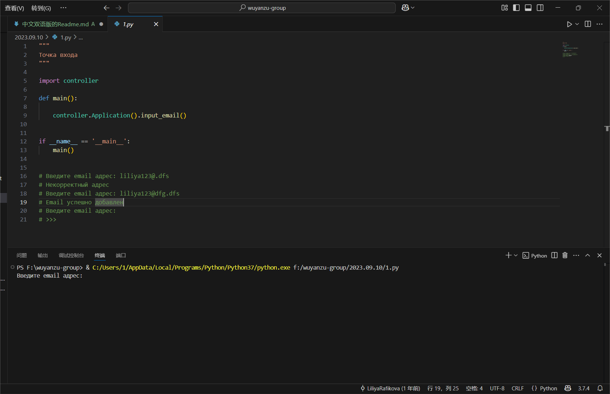
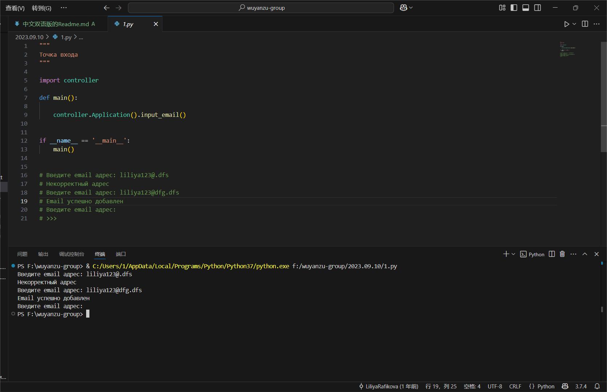

# Top-Python321
---

This is a collection of Python basic usage assignments where the teacher has arranged Python exercises for students, covering topics such as input/output operations, variables and data types, formatted output, conditional statements, loops, file handling and module imports, and function writing.

## ✨ Project Features

- 📝 Practice-Oriented  
    All tasks require students to write code themselves. This hands-on approach helps deepen their understanding and application of the Python programming language, effectively enhancing their coding skills.
- ✅ Gradual Difficulty Increase  
    Tasks start with basic input/output operations and variables, then progress to conditional statements and loops, and finally move on to function definitions, file operations, etc. This forms a learning path that gradually increases in difficulty.
- 💾 Comprehensive Knowledge Coverage  
    It covers many important aspects of Python programming, including but not limited to data types, control structures, functions, modules, file operations, exception handling, etc. This enables students to gain a comprehensive understanding and mastery of the Python programming language.
- 🎨 Feedback and Evaluation Mechanism  
    Students are asked to keep the output results of their code in the form of comments in the code files and report their assignment completion status in the designated "Журнал" service. This helps teachers evaluate and provide feedback on students' learning progress and outcomes.
- 🔑 Combined with Practical Applications  
    The tasks involve scenarios such as password strength checking, taxi fare calculation, and file operations, which are related to real-life or work situations. This enables students to apply their knowledge to practical problems.

## 🚀 Quick Start

### Clone the Project

```bash
git clone https://github.com/Glccccc/wuyanzu-group.git
cd wuyanzu-group
```

### Launch the Project
```bash  
cd wuyanzu-group/2023.04.09
python 1.py
python 2.py
...
```
The project will run in your local ```development environment```.
## 📦 Project Structure
```
wuyanzu-group/
├── 2023.04.09/
│   ├── # HW 2023.04.09.txt
│   ├── 1.py
│   ├── 2.py
│   ├── 3.py
│   ├── 4.py
│   └── 5.py
├── 2023.04.16/
├── 2023.04.23/
├── ...
└── README.md
```
## 📮 Project Main Function Description and Screenshots
<!-- by 管立超 -->
### Tasks and Instructions for 2023.05.14 Files

1. **Implement the strong_password Function**
    
    *Function:* Checks if a password is strong.
    
    *Parameters:*
    - Parameter 1: A required keyword parameter of type str representing the password.
    
    *Return Value:*
    - A bool. Returns True if the password meets the following conditions, otherwise False:
        - Minimum length of 8 characters.
        - Contains both uppercase and lowercase Latin letters.
        - Contains at least two numeric characters.
        - Contains at least one non-alphanumeric character.
    
    *Testing Method:*
    ```python
    strong_password('aA1!') == False  # Insufficient length
    strong_password('aA1!aA1!') == True  # Meets all conditions
    ```
    
    *Test Results:*  
    

2. **Implement the taxi_cost Function**
    
    *Function:* Calculates the taxi fare.
    
    *Parameters:*
    - Parameter 1: A required keyword parameter of type int representing the trip distance in meters.
    - Parameter 2: An optional keyword parameter of type int representing waiting time in minutes, defaulting to 0.
    
    *Return Value:*
    - Returns None if parameters are invalid (e.g., negative values).
    - Otherwise, calculates and returns the fare (as an integer) based on the rules:
        - Base fare is 80 rubles.
        - 6 rubles for every 150 meters.
        - 3 rubles for every minute of waiting.
        - If the trip distance is 0 meters (cancellation), a penalty of 80 rubles plus waiting time cost is added.
        - The final cost is mathematically rounded to the nearest integer.
    
    *Testing Method:*
    ```python
    taxi_cost(1500)
    ```
    
    *Test Results:*  
    

3. **Implement the numbers_strip Function**
    
    *Function:* Removes the n smallest and largest numbers from a list.
    
    *Parameters:*
    - Parameter 1: A required positional-keyword parameter, a list of floats.
    - Parameter 2: An optional positional-keyword parameter n, defaulting to 1, of type int.
    - Parameter 3: A strict keyword parameter of type bool, defaulting to False, to decide whether to return the modified original list or a new list.
    
    *Return Value:*
    - Returns the modified original list or a new list based on the requirements.
    
    *Testing Method:*
    ```python
    nums = [10, 20, 30, 40, 50, 60, 70]
    nums_test = numbers_strip(nums, 3, copy=True)
    nums_test
    ```
    
    *Test Results:*  
    

4. **Implement the countable_nouns Function**
    
    *Function:* Selects the appropriate Russian noun form based on the numeral.
    
    *Parameters:*
    - Parameter 1: A required parameter of type int representing the numeral.
    - Parameter 2: A required tuple parameter containing three str elements corresponding to the three forms of the noun.
    
    *Return Value:*
    - Returns the corresponding noun form based on the numeral rules.
    
    *Testing Method:*
    ```python
    countable_nouns(1, ("год", "года", "лет"))
    ```
    *Test Results:*  
    

5. **Implement the central_tendency Function**
    
    *Function:* Calculates the measures of central tendency for a set of numbers.
    
    *Parameters:*
    - Parameter 1: Positional parameter 1 of type float.
    - Parameter 2: Positional parameter 2 of type float.
    - Parameter 3: Variable number of positional parameters of type float.
    
    *Return Value:*
    - A dictionary containing the following key-value pairs:
        - 'median': Median (float).
        - 'arithmetic': Arithmetic mean (float).
        - 'geometric': Geometric mean (float).
        - 'harmonic': Harmonic mean (float).
    
    *Testing Method:*
    ```python
    central_tendency(1, 2, 3, 4)
    ```
    
    *Test Results:*  
    

6. **Implement the orth_triangle Function**
    
    *Function:* Calculates the third side of a right-angled triangle.
    
    *Parameters:*
    - Parameter 1: Side length of type int or float.
    - Parameter 2: Side length of type int or float.
    - Parameter 3: Hypotenuse of type int or float.  
    
    *Return Value:*
    - Returns the length of the third side (float) if the calculation is possible.
    - Returns None if the parameters are invalid.
    
    *Testing Method:*
    ```python
    orth_triangle(cath1=3, cath2=4)
    ```
    
    *Test Results:*  
    

### Tasks and Instructions for 2023.05.21 Files


### Tasks and Functional Descriptions for April 9, 2023:

1. **Function: `name`**
   - **Functionality:** Retrieves the user's first name, last name, and year of birth, calculates the current age, and outputs the user's information and age in a specified format.
   - **Parameters:**
     - `name`: The user's first name, type `str`.
     - `lastname`: The user's last name, type `str`.
     - `year`: The user's year of birth, type `int`.
   - **Return Value:** No explicit return value. The result is printed directly using the `print` function.
   - **Testing Method:**
     ```python
     name = input('Enter your first name: ')
     lastname = input('Enter your last name: ')
     year = int(input('Enter your year of birth: '))
     print(lastname, name + ',', 2023 - year)
     ```
   - **Test Results:**
     - Input:
       ```
       Enter your first name: Liliya
       Enter your last name: Rafikova
       Enter your year of birth: 1989
       ```
       Output:
       ```
       Rafikova Liliya, 34
       ```
   - **Explanation:**
     - The `input()` function returns the user's input as a string. To convert the year to an integer, we use `int(input())`.
     - The code then prints the last name, first name, and the calculated age (2023 - year of birth).

2. **Function: `number`**
   - **Functionality:** Receives an integer input from the user and outputs the next and previous numbers.
   - **Parameters:**
     - `number`: The integer input by the user, converted to `int` using `int(input())`.
   - **Return Value:** No explicit return value. The result is printed directly using the `print` function.
   - **Testing Method:**
     1. Run the code.
     2. Enter an integer (e.g., `100`).
     3. Observe the output.
   - **Test Results:**
     - Input `100`:
       ```
       The next number for 100 is 101.
       The previous number for 100 is 99.
       ```
     - Input `-5`:
       ```
       The next number for -5 is -4.
       The previous number for -5 is -6.
       ```
     - Input `0`:
       ```
       The next number for 0 is 1.
       The previous number for 0 is -1.
       ```
   - **Explanation:**
     - The code calculates the next number by adding 1 to the input number and the previous number by subtracting 1 from the input number.

3. **Function: `minutes`**
   - **Functionality:** Converts the input minutes into hours and minutes and outputs the result.
   - **Parameters:**
     - `minutes`: The number of minutes input by the user, converted to `int` using `int(input())`.
   - **Return Value:** No explicit return value. The result is printed directly using the `print` function.
   - **Testing Method:**
     1. Run the code.
     2. Enter a number of minutes (e.g., `130`).
     3. Observe the output.
   - **Test Results:**
     - Input `130`:
       ```
       130 minutes is 2 hours 10 minutes.
       ```
     - Input `90`:
       ```
       90 minutes is 1 hour 30 minutes.
       ```
     - Input `60`:
       ```
       60 minutes is 1 hour 0 minutes.
       ```
     - Input `59`:
       ```
       59 minutes is 0 hours 59 minutes.
       ```
   - **Explanation:**
     - The code calculates the number of hours using integer division (`//`) and the remaining minutes using the modulus operator (`%`).

4. **Function: `number`**
   - **Functionality:** Receives a three-digit number, calculates the sum and product of its digits, and outputs the results.
   - **Parameters:**
     - `number`: The three-digit number input by the user, converted to `int` using `int(input())`.
   - **Return Value:** No explicit return value. The result is printed directly using the `print` function.
   - **Testing Method:**
     1. Run the code.
     2. Enter a three-digit number (e.g., `123`).
     3. Observe the output.
   - **Test Results:**
     - Input `123`:
       ```
       Sum of digits = 6
       Product of digits = 6
       ```
     - Input `456`:
       ```
       Sum of digits = 15
       Product of digits = 120
       ```
     - Input `100`:
       ```
       Sum of digits = 1
       Product of digits = 0
       ```
   - **Explanation:**
     - The code extracts the individual digits using modulus and integer division operations and then calculates their sum and product.

5. **Function: `whole_part` and `fractional_part`**
   - **Functionality:** Receives the integer and fractional parts of a number, combines them into a floating-point number (representing miles), converts it to kilometers, and outputs the result.
   - **Parameters:**
     - `whole_part`: The integer part of the number, input by the user as a string.
     - `fractional_part`: The fractional part of the number, input by the user as a string.
   - **Return Value:** No explicit return value. The result is printed directly using the `print` function.
   - **Testing Method:**
     1. Run the code.
     2. Enter the integer and fractional parts separately (e.g., `15` for the integer part and `7` for the fractional part).
     3. Observe the output.
   - **Test Results:**
     - Input integer part `15`, fractional part `7`:
       ```
       15.7 miles = 25.3 km
       ```
     - Input integer part `10`, fractional part `5`:
       ```
       10.5 miles = 16.9 km
       ```
     - Input integer part `0`, fractional part `5`:
       ```
       0.5 miles = 0.8 km
       ```
   - **Explanation:**
     - The code combines the integer and fractional parts into a floating-point number and then converts it to kilometers using the conversion factor (1 mile = 1.61 km).

### Tasks and Functional Descriptions for April 16, 2023:

1. **Function: `num_1`, `num_2`, `num_3`, and `summa_positiv`**
   - **Functionality:** Receives three numbers from the user, determines if they are positive (including positive integers and decimals), sums all positive numbers, and outputs the total.
   - **Parameters:**
     - `num_1`: The first number input by the user, stored as a string.
     - `num_2`: The second number input by the user, stored as a string.
     - `num_3`: The third number input by the user, stored as a string.
     - `summa_positiv`: A variable to store the sum of positive numbers, initialized to `0`.
   - **Return Value:** No explicit return value. The result is printed directly using the `print` function.
   - **Testing Method:**
     1. Run the code.
     2. Enter three numbers (positive, negative, or decimal).
     3. Observe the output.
   - **Test Results:**
     - Input `-23`, `2.3`, `1`:
       ```
       3.3
       ```
     - Input `-1`, `-2`, `-3`:
       ```
       0.0
       ```
     - Input `0`, `5`, `10.5`:
       ```
       15.5
       ```
     - Input `12.3`, `45.6`, `78.9`:
       ```
       136.8
       ```
   - **Explanation:**
     - The code checks if each number is positive by removing the decimal point (if present) and verifying if the remaining string consists only of digits. Positive numbers are converted to floats and added to the sum.

2. **Function: `num_1` and `num_2`**
   - **Functionality:** Receives two integers from the user, determines if the first number is divisible by the second, and outputs the result. If the second number is zero, it outputs an error message. The code also checks if the inputs are valid integers.
   - **Parameters:**
     - `num_1`: The first number input by the user, stored as a string.
     - `num_2`: The second number input by the user, stored as a string.
   - **Return Value:** No explicit return value. The result is printed directly using the `print` function.
   - **Testing Method:**
     1. Run the code.
     2. Enter two numbers (integers or non-integers).
     3. Observe the output.
   - **Test Results:**
     - Input `25` and `3`:
       ```
       25 не делится на 3 нацело
       неполное частное: 8
       остаток: 1
       ```
     - Input `8` and `2`:
       ```
       8 делится на 2 нацело
       частное: 4
       ```
     - Input `2` and `0`:
       ```
       Ошибка, на ноль делить нельзя
       ```
     - Input `abc` and `2`:
       ```
       Ошибка, некорректный ввод
       ```
   - **Explanation:**
     - The code converts the inputs to integers and checks if the second number is zero. If not, it calculates the quotient and remainder to determine divisibility.

3. **Function: `year`**
   - **Functionality:** Determines if the input year is a leap year. If it is, it outputs "да"; otherwise, it outputs "нет". The code also checks if the input is a valid integer.
   - **Parameters:**
     - `year`: The year input by the user, initially stored as a string.
   - **Return Value:** No explicit return value. The result is printed directly using the `print` function.
   - **Testing Method:**
     1. Run the code.
     2. Enter a year (integer or non-integer).
     3. Observe the output.
   - **Test Results:**
     - Input `2020`:
       ```
       да
       ```
     - Input `2023`:
       ```
       нет
       ```
     - Input `1900`:
       ```
       нет
       ```
     - Input `2000`:
       ```
       да
       ```
     - Input `abc`:
       ```
       Ошибка, некорректный ввод
       ```
   - **Explanation:**
     - The code converts the input to an integer and checks the leap year conditions: divisible by 4 but not by 100, or divisible by 400.

4. **Function: `cell_1` and `cell_2`**
   - **Functionality:** Determines if two chessboard squares (input as coordinates) are of the same color. The code checks if the inputs are valid coordinates and then compares the colors of the squares.
   - **Parameters:**
     - `cell_1`: The coordinates of the first square, input by the user as a string.
     - `cell_2`: The coordinates of the second square, input by the user as a string.
   - **Return Value:** No explicit return value. The result is printed directly using the `print` function.
   - **Testing Method:**
     1. Run the code.
     2. Enter two sets of coordinates (e.g., `a1` and `b2`).
     3. Observe the output.
   - **Test Results:**
     - Input `a1` and `b2`:
       ```
       да
       ```
     - Input `a1` and `a2`:
       ```
       нет
       ```
     - Input `h8` and `a1`:
       ```
       нет
       ```
     - Input `e5` and `e4`:
       ```
       да
       ```
     - Input `z9` and `a1`:
       ```
       Ошибка, некорректный ввод
       ```
   - **Explanation:**
     - The code calculates the sum of the ASCII values of the letters and the numeric values of the coordinates. If the parity (even or odd) of these sums is the same for both squares, they are of the same color.

5. **Function: `cell_1` and `cell_2`**
   - **Functionality:** Determines if two chessboard squares are in the same row or column. The code checks if the inputs are valid coordinates and then compares the rows and columns.
   - **Parameters:**
     - `cell_1`: The coordinates of the first square, input by the user as a string.
     - `cell_2`: The coordinates of the second square, input by the user as a string.
   - **Return Value:** No explicit return value. The result is printed directly using the `print` function.
   - **Testing Method:**
     1. Run the code.
     2. Enter two sets of coordinates (e.g., `d4` and `e4`).
     3. Observe the output.
   - **Test Results:**
     - Input `d4` and `e4`:
       ```
       да
       ```
     - Input `a2` and `c4`:
       ```
       нет
       ```
     - Input `a1` and `a8`:
       ```
       да
       ```
     - Input `h8` and `a1`:
       ```
       нет
       ```
     - Input `z9` and `a1`:
       ```
       Ошибка, некорректный ввод
       ```
   - **Explanation:**
     - The code compares the letters (columns) and numbers (rows) of the coordinates. If either the columns or rows match, the squares are in the same row or column.

6. **Function: `cell_1` and `cell_2`**
   - **Functionality:** Determines if two chessboard squares are adjacent (horizontally, vertically, or diagonally). The code checks if the inputs are valid coordinates and then calculates the differences in rows and columns.
   - **Parameters:**
     - `cell_1`: The coordinates of the first square, input by the user as a string.
     - `cell_2`: The coordinates of the second square, input by the user as a string.
   - **Return Value:** No explicit return value. The result is printed directly using the `print` function.
   - **Testing Method:**
     1. Run the code.
     2. Enter two sets of coordinates (e.g., `g3` and `f2`).
     3. Observe the output.
   - **Test Results:**
     - Input `g3` and `f2`:
       ```
       Да
       ```
     - Input `c6` and `d4`:
       ```
       Нет
       ```
     - Input `a1` and `b2`:
       ```
       Да
       ```
     - Input `h8` and `g7`:
       ```
       Да
       ```
     - Input `z9` and `a1`:
       ```
       Ошибка, некорректный ввод
       ```
   - **Explanation:**
     - The code calculates the differences in ASCII values of the letters and the numeric values of the coordinates. If both differences are within -1 to 1, the squares are adjacent.
     <!-- by huangjiaxaing -->


<!--2023.09.10文件    by 刘兴发 -->
# Email Validator

A lightweight and easy-to-use command-line tool for validating email addresses and saving valid ones to a file.

## ✨ Features

- 📝 Verify if the entered email address is correct
- ✅ Save a valid email address to a file
- 💾 Data is saved in a local text file
- 🎨 Simple command-line interface, easy to use

## 🚀 Getting Started

### Clone the repository

```bash
git clone https://github.com/zaizai913/wuyanzu-group.git
cd Email Validator
```

### Install dependencies

```bash
pip install -r requirements.txt
```

### Run the app

```bash
python 1.py
```

The application will launch a command-line interface, prompting you to enter email addresses.

## 📦 Project Structure

```
EmailValidator/
├── model.py            # Data processing and storage model
├── view.py             # User interface logic
├── controller.py       # Business logic coordination
├── 1.py                # Entry point
└── README.md
```

## 📮 Primary function & Screenshot

## 1.py
This is the entry file of the program, responsible for launching the application.

Functionality:
    Import the controller module.
    In the main function, create an instance of the Application class and call its input_email method.
    Use if __name__ == '__main__': to ensure that the main function is executed only when this file is run directly.

## controller.py
The controller module, responsible for coordinating the interaction between the model and the view.

Functionality:
    Import the model and view modules.
    Application class:
        save_email method:
            Create an instance of the Email class to validate whether the email address is valid.
            If valid, call the FileIO.add_email method to save the address to a file.
            Call the CLI.save_email method to display a success message to the user.
            If invalid, catch the ValueError exception and call the CLI.invalid_email method to display an error message to the user.
        input_email method:
            Use the CLI.input_email method to get the email address from the user.
            If the user inputs an empty string, exit the loop.
            Otherwise, call the save_email method to process the input address.

## model.py
The model module, responsible for data processing and storage.

Functionality:
    Email class:
        Use a regular expression to validate whether the email address conforms to the standard format.
        If the address is valid, store it in the private attribute __email.
        If invalid, raise a ValueError exception.
    FileIO class:
        Provide the static method add_email to append the email address to the specified file.
        The default save path is the emails.txt file in the program's running directory.

## view.py
The view module, responsible for user interaction.

Functionality:
    Provide static methods for user interaction:
        input_email: Get the email address from standard input.
        invalid_email: Display an invalid address message to the user.
        save_email: Display a successful save message to the user.


1.Enter an email address

[Image...]


2.Display validation results

[Image...]


<!--2023.09.10文件 by 刘兴发 -->


<!--2023.10.15文件 by 刘兴发 -->
<!--2023.10.15文件 #HW2023.10.15.1 by 刘兴发 -->
# Database Installation and Configuration Guide
## Software Installation
For Windows OS, download the MySQL Installer package:
[MySQL :: Download MySQL Installer](https://dev.mysql.com/downloads/installer/) 

Run the MySQL Installer package.
Perform installation and configuration of components according to the recommendations in the provided video tutorial.

For other operating systems, download the individual components:
[MySQL :: MySQL Community Downloads](https://dev.mysql.com/downloads/) 

- MySQL Community Server
- MySQL Shell
- MySQL Workbench

Install the components according to the requirements of your operating system. Installation instructions:
[MySQL :: MySQL 8.0 Reference Manual :: 2 Installing MySQL](https://dev.mysql.com/doc/refman/8.0/en/installing.html) 

Configuration options are also described in the video tutorial.

To test functionality, execute the following commands sequentially in the MySQL Shell client application (replace with your own port number if changed):
```sql

\connect root@localhost:3306
\sql
show databases;

```

Take screenshots:
    Task Manager window with the local MySQL server service highlighted
    MySQL Shell window with executed commands (output of all commands should be visible)
    MySQL Workbench window logged into the local server connection (navigation panel, editor window, etc., should be visible)
========================
Place the screenshots in the current repository directory as JPG or PNG files named 1.1, 1.2, and 1.3, respectively.

<!--2023.10.15文件 #HW2023.10.15.2 by 刘兴发 -->
# Music Collection Management System

A database system for managing a music collection, supporting information management for artists, music albums, songs, genres, and publishers.

## ✨ Features

- 🎵 Manage artist information
- 📀 Manage music album information
- 🎶 Manage song information
- 🎭 Manage music genres
- 🌐 Manage publishers
- 📐 Database design and modeling

## 🚀 Getting Started

### 1. Install MySQL

- **Windows**: Download and install MySQL Installer:
  [MySQL :: Download MySQL Installer](https://dev.mysql.com/downloads/installer/)
- **Other Operating Systems**: Download and install MySQL Community Edition:
  [MySQL :: MySQL Community Downloads](https://dev.mysql.com/downloads/)

### 2. Create Database and Tables

Run the following SQL script to create the database and tables:

```sql
-- Create database
CREATE DATABASE mus_library;

-- Use database
USE mus_library;

-- Create tables
create table styles (
    id tinyint unsigned primary key auto_increment,
    style varchar(50) not null unique
);

create table performers (
    id smallint unsigned primary key auto_increment,
    performer varchar(100) not null unique
);

create table publishers (
    id smallint unsigned primary key auto_increment,
    publisher varchar(100) not null unique,
    country varchar(50) not null
);

create table collections (
    id smallint unsigned primary key auto_increment,
    collection varchar(100) not null unique,
    performer_id smallint unsigned not null,
    `date` year,
    style_id tinyint unsigned not null,
    publisher_id smallint unsigned not null,
    foreign key (performer_id) references performers (id),
    foreign key (style_id) references styles (id)  ,
  foreign key (publisher_id) references publishers (id)
);

create table songs (
  id int unsigned primary key auto_increment,
  song varchar(100) not null,
  performer_id smallint unsigned not null,
  collection_id smallint unsigned not null,
    style_id tinyint unsigned not null,
  duration time not null,
    foreign key (performer_id) references performers (id),
  foreign key (collection_id) references collections (id),
  foreign key (style_id) references styles (id)
);

```

3. Database Modeling
Use a database modeling tool (such as MySQL Workbench or dbdiagram.io) to create a database diagram and save it as a JPG or PNG image file named 2.1.

4. Save SQL Script
Save the above SQL script to a file named 2.2.sql.

## 📦 Project Structure

        mus_library/
        ├── 2.1.png          # Database diagram
        ├── 2.2.sql          # SQL script
        └── README.md

## 📮 Primary Function and Screenshot
1. Database Diagram

2. SQL Script
Saved as 2.2.sql file.

## 📝 Project Description
Database Diagram: Created using dbdiagram.io or MySQL Workbench.
SQL Script: Contains DDL queries to create the database and tables.
<!--2023.10.15文件 #HW2023.10.15.2 by 刘兴发 -->
