# Top-Python321
---

这是一个关于Python基础用法的作业，老师为学生布置了python的输入输出操作、变量和数据类型、格式化输出、条件语句、循环结构、处理文件操作和模块导入、函数编写等相关练习。

## ✨ 项目特点

- 📝 实践导向  
    所有任务都要求学生亲自动手编写代码，通过实践来加深对Python编程语言的理解和应用能力。这种实践导向的方式有助于学生更好地掌握编程技能。
- ✅ 逐步提升难度  
    任务从基础的输入输出操作、变量和数据类型，到条件语句、循环结构，再到函数定义与调用、文件操作等，逐步提升难度，形成一个由浅入深的学习路径。
- 💾 覆盖知识全面  
    涵盖了Python编程的多个重要方面，包括但不限于数据类型、控制结构、函数、模块、文件操作、异常处理等，使学生能够全面地了解和掌握Python编程语言。
- 🎨 反馈和评估机制  
    要求学生在代码文件中以注释的形式保留程序运行的输出结果，并在指定的“Журнал”服务中报告作业完成情况，这有助于教师对学生的学习进度和成果进行评估和反馈。
- 🔑 与实际应用结合  
    任务中涉及的场景如密码强度检查、出租车费用计算、文件操作等，都是与实际生活或工作相关的应用场景，使学生能够将所学知识应用到实际问题中。

## 🚀 快速开始

### 克隆项目

``` bash
git clone https://github.com/Glccccc/wuyanzu-group.git
cd wuyanzu-group
```

### 启动项目

```bash
cd wuyanzu-group/2023.04.09
python 1.py
python 2.py
...
```

项目将运行在 `本地的开发环境`

## 📦 项目结构

```
wuyanzu-group/
├── 2023.04.09/
│   ├── # HW 2023.04.09.txt
│   ├── 1.py
│   ├── 2.py
│   ├── 3.py
│   ├── 4.py
│   └── 5.py
├── 2023.04.16/
├── 2023.04.23/
├── ...
└── README.md
```
<!-- by 管立超 -->

## 📮 项目主要功能说明与截图

### 2023.05.14/文件下的任务、功能及使用方法：  
1. **编写 strong_password 函数**  
   
    *功能：* 检查密码是否为强密码。  
    
    *参数：*   
    - 参数1： 关键字必需参数，类型为 str，表示密码。  
     
    
    *返回值：* 
   - 类型为 bool。当密码满足以下条件时返回 True，否则返回 False。
    
    *测试方法如下：*
    ```python
    strong_password('aA1!') == False  # 长度不够
    strong_password('aA1!aA1!') == True  # 符合所有条件 
    ```
    
    *测试结果：*  
   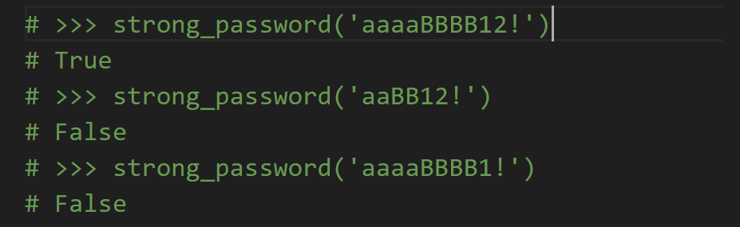  
   
2. **编写 taxi_cost 函数**  
   
    *功能：* 计算出租车费用。

    *参数：* 
     - 参数1：关键字必需参数，类型为 str，表示密码。
     - 参数2：关键字参数（可选），表示等待时间（分钟），默认为 0，类型为 int。  
    
    *返回值：* 
    - 若参数不合理（如为负数），返回 None。
    - 否则，根据规则计算并返回费用（整数）。

    *测试方法如下：*
    ```python
   taxi_cost(1500)
   ```
   
    *测试结果：*  
    
3. **编写 numbers_strip 函数**  
   
    *功能：* 从列表中删除 n 个最小和最大数。  
    
    *参数：*   
    - 参数1：一个必需的位置 - 关键字参数，列表（元素为 float）。
    - 参数2：一个可选的位置 - 关键字参数 n，默认为 1，类型为 int。
    - 参数3：一个严格的关键字参数，类型为 bool，默认 False，用于决定返回修改后的原列表还是新列表。  
     
    
   *返回值：* 按要求返回修改后的原列表或新列表。
    
    *测试方法如下：*
   ```python
   nums =[10,20,30,40,50,60,70]
   nums_test= numbers_strip(nums, 3, copy=True)
   nums_test
   ```
   
    *测试结果：*  
    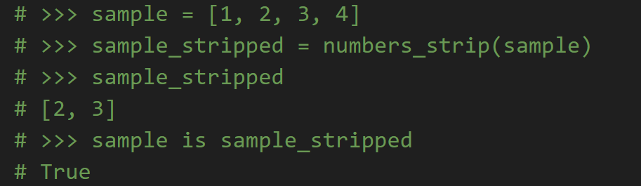
4. **编写 countable_nouns 函数**  
   
    *功能：* 根据数词选择合适的俄语名词形式。  
    
    *参数：*   
    - 参数1：一个必需的 int 类型参数，表示数词。
    - 参数2：一个必需的 tuple 参数，包含三个 str，分别对应名词的三种形式。  
    
    *返回值：* 根据数词规则返回对应的名词形式。
    
    *测试方法如下：*  
    ```python
    countable_nouns(1, ("год", "года", "лет"))
    ```
    
    *测试结果：*  
    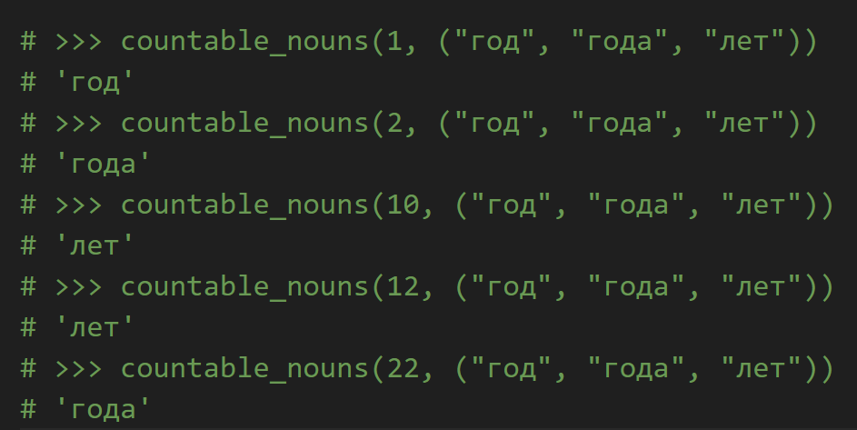
5. **编写 central_tendency 函数**   
   
    *功能：* 计算一系列数的中心趋势度量。  
    
    *参数：* 
    - 参数1：位置参数1。
    - 参数2：位置参数2。
    - 参数3：任意数量的位置参数。  
    
    *返回值：* 一个字典，包含以下键值对：
    - 'median'：中位数（float）。
    - 'arithmetic'：算术平均数（float）。
    - 'geometric'：几何平均数（float）。
    - 'harmonic'：调和平均数（float）。
    
    *测试方法如下：*  
    ```python
    central_tendency(1, 2, 3, 4)
    ```
    
    *测试结果：*   
    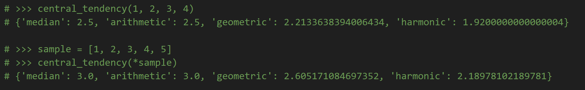

6. **编写 orth_triangle 函数**  
   
    *功能：* 计算直角三角形的第三边。  
    
    *参数：*   
    - 参数1：边长，类型为 int 或 float。
    - 参数2：边长，类型为 int 或 float。
    - 参数3：斜边，类型为 int 或 float。
     
   
   *返回值：*
    - 若计算可行，返回第三边长度（float）。
    - 否则（如参数不合理），返回 None。
   
    *测试方法如下：*  
    ```python
    orth_triangle(cath1=3, cath2=4)
    ```
   
    *测试结果：*   
    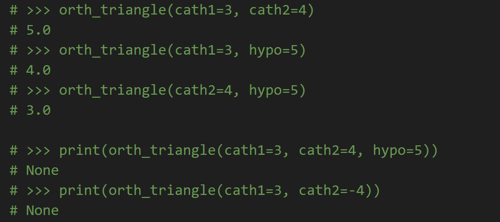
   
### 2023.05.21/文件下的任务、功能及使用方法：
<!-- by 管立超 -->
### 2023.04.09/文件下的任务、功能及使用方法：
1. **编写 name 函数**  
   
        *功能： 获取用户输入的姓名、姓氏和出生年份，并计算当前年龄，最后按照指定格式输出用户信息和年龄。  
        
        *参数：   
        -name：用户输入的名字，类型为 str。
        -lastname：用户输入的姓氏，类型为 str。
        -year：用户输入的出生年份，类型为 int。
           
        *返回值：*
        - 无返回值，直接通过 print 函数输出结果。
        
        *测试方法如下：
        name = input('Введите имя: ')
        lastname = input('Введите фамилию: ')
        year = int(input('Введите год рождения: '))
        
        print(lastname, name + ',', 2023 - year)
        
        *测试结果：
        -运行代码后，依次输入名字、姓氏和出生年份，程序会输出对应的格式化信息.
        假设输入如下：
        Введите имя: Лилия
        Введите фамилию: Рафикова
        Введите год рождения: 1989


        *输出结果为：
        Рафикова Лилия, 34


        #关于 input() 函数的返回值类型:
        input() 函数默认返回用户输入的内容作为字符串（str）类型。如果需要其他类型的数据，如整数或浮点数，需要显式地进行类型转换。
        例如：
        int(input())：将用户输入的字符串转换为整数。
        float(input())：将用户输入的字符串转换为浮点数。
        在代码中：
        name = input('Введите имя: ')：获取用户输入的名字，返回类型为 str。
        lastname = input('Введите фамилию: ')：获取用户输入的姓氏，返回类型为 str。
        year = int(input('Введите год рождения: '))：获取用户输入的出生年份，并将其转换为 int 类型。
2. **编写 number 函数**  

        *功能：接收用户输入的一个整数，然后输出该整数的下一个数和上一个数。
        
        *参数：
        -number：用户输入的整数，通过 input() 函数获取，并使用 int() 函数将其转换为整数类型。这是代码中唯一的变量参数。
        
        *返回值：代码没有显式的返回值，而是直接通过 print() 函数将结果输出到控制台。
        
        *测试方法如下：
        1.运行代码。
        2.在提示输入时，输入一个整数（例如 100）。
        3.观察输出结果是否符合预期。
        
        *测试结果：
        输入 100，输出结果为：
        
        Cледующее за числом 100 число: 101
        Для числа 100 предыдущее число: 99
        输入 -5，输出结果为：
        
        Cледующее за числом -5 число: -4
        Для числа -5 предыдущее число: -6
        输入 0，输出结果为：
        
        Cледующее за числом 0 число: 1
        Для числа 0 предыдущее число: -1
        
        #代码解释：
        1.number = int(input('Введите число: '))：提示用户输入一个数字，并通过 input() 函数获取用户输入的字符串，然后使用 int() 函数将其转换为整数类型，存储到变量 number 中。
        2.print(f'Cледующее за числом {number} число: {number + 1}\n'：使用格式化字符串（f-string），将变量 number 和 number + 1 的值嵌入到字符串中，并输出。\n 是换行符，用于换行输出下一行内容。
        3.f'Для числа {number} предыдущее число: {number - 1}')：同样使用格式化字符串，将变量 number 和 number - 1 的值嵌入到字符串中，并输出。
3. **编写 minutes 函数** 

        *功能：将用户输入的分钟数转换为小时和分钟的形式，并输出结果。
    
        *参数：minutes：用户输入的分钟数，通过 input() 函数获取，并使用 int() 函数将其转换为整数类型。这是代码中唯一的变量参数。
    
        *返回值：代码没有显式的返回值，而是直接通过 print() 函数将结果输出到控制台。
    
        *测试方法如下：
        1.运行代码。
        2.在提示输入时，输入一个整数（例如 130）。
        3.观察输出结果是否符合预期。
    
        *测试结果：
        输入 130，输出结果为：
        130 мин - это 2 час 10 мин
        输入 90，输出结果为：
        90 мин - это 1 час 30 мин
        输入 60，输出结果为：
        60 мин - это 1 час 0 мин
        输入 59，输出结果为：
        59 мин - это 0 час 59 мин
    
        #代码解释：
        1.minutes = int(input('Введите количество минут: '))
        提示用户输入一个数字，并通过 input() 函数获取用户输入的字符串。
        使用 int() 函数将输入的字符串转换为整数类型，存储到变量 minutes 中。
    
        2.print(f"{minutes} мин - это {minutes // 60} час {minutes % 60} мин")
        使用格式化字符串（f-string）输出结果。
        minutes // 60：计算小时数，使用整除运算符 //，结果为整数部分，表示完整的小时数。
    
        3.minutes % 60：计算剩余的分钟数，使用取模运算符 %，结果为除以 60 后的余数，表示不足一小时的分钟数。
        将 minutes、minutes // 60 和 minutes % 60 的值嵌入到字符串中，并输出。

4. **编写 number 函数** 

        *功能：接收用户输入的一个三位数，然后计算并输出该三位数各个位上的数字之和以及各个位上的数字之积。
    
        *参数：
        -number：用户输入的三位数，通过 input() 函数获取，并使用 int() 函数将其转换为整数类型。这是代码中唯一的变量参数。
    
        *返回值：
        代码没有显式的返回值，而是直接通过 print() 函数将结果输出到控制台。
    
        *测试方法如下：
        1.运行代码。
        2.在提示输入时，输入一个三位数（例如 123）。
        3.观察输出结果是否符合预期。
    
        *测试结果：
        输入 123，输出结果为：
        
        Сумма цифр = 6
        Произведение цифр = 6
        输入 456，输出结果为：
        
        Сумма цифр = 15
        Произведение цифр = 120
        输入 100，输出结果为：
    
        Сумма цифр = 1
        Произведение цифр = 0
    
        #代码解释：
        1.number = int(input('Введите трехзначное число: '))
        提示用户输入一个数字，并通过 input() 函数获取用户输入的字符串。使用 int() 函数将输入的字符串转换为整数类型，存储到变量 number 中。
    
        2.num_1 = number % 10：计算个位数。使用取模运算符 %，结果为 number 除以 10 的余数，即个位数。num_2 = (number // 10) % 10：计算十位数。先用 number // 10 去掉个位数，再对 10 取模，得到十位数。num_3 = (number // 100) % 10：计算百位数。先用 number // 100 去掉个位和十位数，再对 10 取模，得到百位数。
    
        3.print(f"Сумма цифр = {num_1 + num_2 + num_3}")：计算各个位上的数字之和，并通过格式化字符串输出。print(f"Произведение цифр = {num_1 * num_2 * num_3}")：计算各个位上的数字之积，并通过格式化字符串输出。

5. **编写 whole_part和fractional_part  函数** 


        *功能：接收用户输入的整数部分和小数部分，将它们组合成一个浮点数（表示英里数），然后将其转换为公里数并输出结果。
    
        *参数：
        -whole_part：用户输入的整数部分，通过 input() 函数获取，存储为字符串类型。
        -fractional_part：用户输入的小数部分，通过 input() 函数获取，存储为字符串类型。
    
        *返回值：代码没有显式的返回值，而是直接通过 print() 函数将结果输出到控制台。
        
        *测试方法如下：
        1.运行代码。
        2.在提示输入时，分别输入整数部分和小数部分（例如整数部分输入 15，小数部分输入 7）。
        3.观察输出结果是否符合预期。
    
        *测试结果：
        输入整数部分 15，小数部分 7，输出结果为：
        15.7 миль = 25.3 км
        输入整数部分 10，小数部分 5，输出结果为：
        10.5 миль = 16.9 км
        输入整数部分 0，小数部分 5，输出结果为：
        0.5 миль = 0.8 км
    
        #代码解释：
        1.输入整数部分和小数部分：
        whole_part = input('Введите целую часть: ')：提示用户输入整数部分，并将其存储为字符串。
        fractional_part = input('Введите дробную часть: ')：提示用户输入小数部分，并将其存储为字符串。
    
        2.组合并转换为浮点数：
        miles = float(f'{whole_part}.{fractional_part}')：使用格式化字符串将整数部分和小数部分组合成一个完整的浮点数字符串（例如 15.7），然后通过 float() 函数将其转换为浮点数类型。
    
        3.计算并输出结果：
        print(f'{miles} миль = {miles * 1.61:.1f} км')：
        计算公里数：miles * 1.61，其中 1.61 是英里到公里的换算系数。
        使用格式化字符串输出结果，其中 :.1f 表示保留一位小数。

### 2023.04.16/文件下的任务、功能及使用方法：

1. **编写 num_1、num_2、num_3和 summa_positiv 函数** 

        *功能：接收用户输入的三个数，判断这些数是否为正数（包括正整数和正小数），并将所有正数相加，最终输出正数的总和。
    
        *参数：
        -num_1：用户输入的第一个数，通过 input() 函数获取，存储为字符串类型。
    
        -num_2：用户输入的第二个数，通过 input() 函数获取，存储为字符串类型。
    
        -num_3：用户输入的第三个数，通过 input() 函数获取，存储为字符串类型。
    
        -summa_positiv：用于存储正数的总和，初始值为 0
    
        *返回值：代码没有显式的返回值，而是直接通过 print() 函数将结果输出到控制台。
    
        *测试方法如下：
        1.运行代码。
        2.在提示输入时，分别输入三个数（可以是正数、负数或小数）。
        3.观察输出结果是否符合预期。
    
        *测试结果：
        输入 -23，2.3，1，输出结果为：3.3
    
        输入 -1，-2，-3，输出结果为：0.0
    
        输入 0，5，10.5，输出结果为：15.5
    
        输入 12.3，45.6，78.9，输出结果为：136.8
    
        #代码解释：
        1.输入三个数：
        num_1 = input('Введите первое число: ')：提示用户输入第一个数，并将其存储为字符串。
        num_2 = input('Введите второе число: ')：提示用户输入第二个数，并将其存储为字符串。
        num_3 = input('Введите третье число: ')：提示用户输入第三个数，并将其存储为字符串。
    
        2.判断是否为正数并累加：
        if num_1.replace('.', '', 1).isdecimal()：
        num_1.replace('.', '', 1)：将字符串中的第一个小数点移除（如果存在）。这是为了处理小数输入。
        .isdecimal()：检查移除小数点后的字符串是否只包含数字。如果是，则说明原字符串是一个正数（包括正整数和正小数）。
        如果是正数，则通过 float(num_1) 将字符串转换为浮点数，并将其加到 summa_positiv 中。
        同样的逻辑应用于 num_2 和 num_3。
    
        3.输出结果：
        print(f'{summa_positiv:.1f}')：将正数的总和输出到控制台，保留一位小数。

2. **编写 num_1与num_2  函数** 

        *功能：接收用户输入的两个整数，判断第一个数是否能被第二个数整除，并输出相应的结果。如果第二个数为零，则提示用户不能除以零。此外，代码还会检查用户输入是否为有效的整数。
    
        *参数：
        -num_1：用户输入的第一个数，通过 input() 函数获取，存储为字符串类型。
        -num_2：用户输入的第二个数，通过 input() 函数获取，存储为字符串类型。
    
        *返回值：代码没有显式的返回值，而是直接通过 print() 函数将结果输出到控制台。
    
        *测试方法如下：
        1.运行代码。
        2.在提示输入时，分别输入两个数（可以是整数或非整数）。
        3.观察输出结果是否符合预期。
    
        *测试结果：
        输入 25 和 3，输出结果为：
        25 не делится на 3 нацело
        неполное частное: 8
        остаток: 1
    
        输入 8 和 2，输出结果为：
        8 делится на 2 нацело
        частное: 4
    
        输入 2 和 0，输出结果为：
        Ошибка, на ноль делить нельзя
    
        输入 abc 和 2，输出结果为：
        Ошибка, некорректный ввод
    
        #代码解释：
        1.输入两个数：
        num_1 = input('Введите первое число: ')：提示用户输入第一个数，并将其存储为字符串。
        num_2 = input('Введите второе число: ')：提示用户输入第二个数，并将其存储为字符串。
    
        2.检查输入是否为整数：
        if num_1.isdecimal() and num_2.isdecimal():：
        使用 isdecimal() 方法检查输入是否为非负整数。如果两个输入都是非负整数，则进入下一步。
        如果输入不合法（例如包含字母或负数），则输出错误信息：
        -Python-
        print('Ошибка, некорректный ввод')
    
        3.转换为整数并进行除法运算：
        num_1 = int(num_1) 和 num_2 = int(num_2)：将输入的字符串转换为整数。
        检查除数是否为零：
        -Python-
        if num_2 == 0:
            print('Ошибка, на ноль делить нельзя')
        如果除数为零，则直接输出错误信息并结束程序。
        如果除数不为零，则继续执行下一步。
    
        4.判断是否整除并输出结果：
        使用“海象运算符”（:=）计算余数：
        -Python-
        if remainder_modulo := num_1 % num_2:
            add1, add2, add3 = 'не ', 'неполное ', f'остаток: {remainder_modulo}'
        如果余数不为零，则说明不能整除，设置相应的提示信息。
        如果余数为零，则说明可以整除，不设置额外的提示信息。
        输出结果：
        -Python-
        print(f'{num_1} {add1}делится на {num_2} нацело\n'
            f'{add2}частное: {num_1 // num_2}\n'
            f'{add3}')

3. **编写  year  函数** 
        
        *功能：判断用户输入的年份是否为闰年。如果输入的年份是闰年，则输出“да”；如果不是闰年，则输出“нет”。此外，代码还会检查用户输入是否为有效的整数。
       
        *参数：
        -year：用户输入的年份，通过 input() 函数获取，初始为字符串类型。
       
        *返回值：代码没有显式的返回值，而是直接通过 print() 函数将结果输出到控制台。
       
        *测试方法如下：
        1.运行代码。
        2.在提示输入时，输入一个年份（可以是整数或非整数）。
        3.观察输出结果是否符合预期。
       
        *测试结果：
        输入 2020，输出结果为：
        да
        输入 2023，输出结果为：
        нет
        输入 1900，输出结果为：
        нет
        输入 2000，输出结果为：
        да
        输入 abc，输出结果为：
        Ошибка, некорректный ввод
       
        #代码解释：
        1.输入年份：
        year = input('Введите год: ')：提示用户输入一个年份，并将其存储为字符串。
       
        2.检查输入是否为整数：
        if year.isdecimal():：
        使用 isdecimal() 方法检查输入是否为非负整数。如果输入是有效的整数，则继续下一步。
        如果输入不合法（例如包含字母或负数），则输出错误信息：
        -Python-
           print('Ошибка, некорректный ввод')
       
        3.转换为整数并判断是否为闰年：
        year = int(year)：将输入的字符串转换为整数。
        使用闰年的判断规则：
        -Python-
        if year % 4 == 0 and year % 100 != 0 or year % 400 == 0:
            print('да')
        else:
            print('нет')
        闰年的条件是：
        年份能被4整除但不能被100整除。
        或者年份能被400整除。
        如果满足上述条件之一，则输出“да”；否则输出“нет”。

4. **编写 cell_1与cell_2  函数** 

        *功能：判断用户输入的两个国际象棋棋盘上的格子是否颜色相同。国际象棋棋盘由8×8的格子组成，每个格子用一个字母（a到h）和一个数字（1到8）表示。代码会检查输入的格子坐标是否有效，并判断这两个格子是否在同一颜色上。
    
        *参数：
        -cell_1：用户输入的第一个格子的坐标，通过 input() 函数获取，存储为字符串类型。
        -cell_2：用户输入的第二个格子的坐标，通过 input() 函数获取，存储为字符串类型。
    
        *返回值：代码没有显式的返回值，而是直接通过 print() 函数将结果输出到控制台。
    
        *测试方法如下：
        1.运行代码。
        2.在提示输入时，分别输入两个格子的坐标（例如 a1 和 b2）。
        3.观察输出结果是否符合预期。
    
        *测试结果：
        输入 a1 和 b2，输出结果为：
        да
        输入 a1 和 a2，输出结果为：
        нет
        输入 h8 和 a1，输出结果为：
        нет
        输入 e5 和 e4，输出结果为：
        да
        输入 z9 和 a1，输出结果为：
        Ошибка, некорректный ввод
    
        #代码解释：
        1.输入两个格子的坐标：
        cell_1 = input('Введите координаты первой клетки: ')：提示用户输入第一个格子的坐标，并将其存储为字符串。
        cell_2 = input('Введите координаты второй клетки: ')：提示用户输入第二个格子的坐标，并将其存储为字符串。
    
        2.检查输入的坐标是否有效：
        使用多条件判断：
        -Python-
        if (
                'a' <= cell_1[0] <= 'h'
            and '1' <= cell_1[1] <= '8'
            and 'a' <= cell_2[0] <= 'h'
            and '1' <= cell_2[1] <= '8'
        ):
        检查第一个格子的字母部分是否在 a 到 h 之间。
        检查第一个格子的数字部分是否在 1 到 8 之间。
        检查第二个格子的字母部分是否在 a 到 h 之间。
        检查第二个格子的数字部分是否在 1 到 8 之间。
        如果任何一个条件不满足，则输出错误信息：
        -Python-
        print('Ошибка, некорректный ввод')
    
        3.判断两个格子是否颜色相同：
        使用 ord() 函数将字母转换为 ASCII 码值，然后加上数字部分的整数值：
        -Python-
        if (ord(cell_1[0]) + int(cell_1[1])) % 2 == (ord(cell_2[0]) + int(cell_2[1])) % 2:
        计算第一个格子的字母和数字之和的奇偶性。
        计算第二个格子的字母和数字之和的奇偶性。
        如果两个格子的奇偶性相同，则说明它们颜色相同，输出“да”；否则输出“нет”。

5. **编写 cell_1与cell_2 函数** 

        *功能：判断用户输入的两个国际象棋棋盘上的格子是否在同一行或同一列。国际象棋棋盘由8×8的格子组成，每个格子用一个字母（a到h）和一个数字（1到8）表示。代码会检查输入的格子坐标是否有效，并判断这两个格子是否在同一行或同一列。
        
        *参数：
        -cell_1：用户输入的第一个格子的坐标，通过 input() 函数获取，存储为字符串类型。
        -cell_2：用户输入的第二个格子的坐标，通过 input() 函数获取，存储为字符串类型。
        
        *返回值：代码没有显式的返回值，而是直接通过 print() 函数将结果输出到控制台。
        
        *测试方法如下：
        1.运行代码。
        2.在提示输入时，分别输入两个格子的坐标（例如 d4 和 e4）。
        3.观察输出结果是否符合预期。
        
        *测试结果：
        输入 d4 和 e4，输出结果为：
        да
        输入 a2 和 c4，输出结果为：
        нет
        输入 a1 和 a8，输出结果为：
        да
        输入 h8 和 a1，输出结果为：
        нет
        输入 z9 和 a1，输出结果为：
        Ошибка, некорректный ввод
        
        #代码解释：
        1.输入两个格子的坐标：
        cell_1 = input('Введите координаты первой клетки: ')：提示用户输入第一个格子的坐标，并将其存储为字符串。
        cell_2 = input('Введите координаты второй клетки: ')：提示用户输入第二个格子的坐标，并将其存储为字符串。
        
        2.检查输入的坐标是否有效：
        使用多条件判断：
        -Python-
        if (
                'a' <= cell_1[0] <= 'h'
            and '1' <= cell_1[1] <= '8'
            and 'a' <= cell_2[0] <= 'h'
            and '1' <= cell_2[1] <= '8'
        ):
        检查第一个格子的字母部分是否在 a 到 h 之间。
        检查第一个格子的数字部分是否在 1 到 8 之间。
        检查第二个格子的字母部分是否在 a 到 h 之间。
        检查第二个格子的数字部分是否在 1 到 8 之间。
        如果任何一个条件不满足，则输出错误信息：
        -Python-
        print('Ошибка, некорректный ввод')
        
        3.判断两个格子是否在同一行或同一列：
        比较两个格子的字母部分（列）和数字部分（行）：
        -Python-
        if cell_1[0] == cell_2[0] or cell_1[1] == cell_2[1]:
            print('да')
        else:
            print('нет')
        如果两个格子的字母部分相同（即在同一列），或者数字部分相同（即在同一行），则输出“да”。
        否则输出“нет”。
6. **编写 whole_part和fractional_part  函数** 

        *功能：判断用户输入的两个国际象棋棋盘上的格子是否相邻。国际象棋棋盘由8×8的格子组成，每个格子用一个字母（a到h）和一个数字（1到8）表示。代码会检查输入的格子坐标是否有效，并判断这两个格子是否在水平、垂直或对角方向上相邻。
    
        *参数：
        -cell_1：用户输入的第一个格子的坐标，通过 input() 函数获取，存储为字符串类型。
        -cell_2：用户输入的第二个格子的坐标，通过 input() 函数获取，存储为字符串类型。
    
        *返回值：代码没有显式的返回值，而是直接通过 print() 函数将结果输出到控制台。
    
        *测试方法如下：
        1.运行代码。
        2.在提示输入时，分别输入两个格子的坐标（例如 g3 和 f2）。
        3.观察输出结果是否符合预期。
    
        *测试结果：
        输入 g3 和 f2，输出结果为：
        Да
        输入 c6 和 d4，输出结果为：
        Нет
        输入 a1 和 b2，输出结果为：
        Да
        输入 h8 和 g7，输出结果为：
        Да
        输入 z9 和 a1，输出结果为：
        Ошибка, некорректный ввод
    
        #代码解释：
        1.输入两个格子的坐标：
        cell_1 = input('Введите координаты первой клетки: ')：提示用户输入第一个格子的坐标，并将其存储为字符串。
        cell_2 = input('Введите координаты второй клетки: ')：提示用户输入第二个格子的坐标，并将其存储为字符串。
    
        2.检查输入的坐标是否有效：
        使用多条件判断：
        -Python-
        if ('a' <= cell_1[0] <= 'h'
                and '1' <= cell_1[1] <= '8'
                and 'a' <= cell_2[0] <= 'h'
                and '1' <= cell_2[1] <= '8'):
        检查第一个格子的字母部分是否在 a 到 h 之间。
        检查第一个格子的数字部分是否在 1 到 8 之间。
        检查第二个格子的字母部分是否在 a 到 h 之间。
        检查第二个格子的数字部分是否在 1 到 8 之间。
        如果任何一个条件不满足，则输出错误信息：
        -Python-
        print('Ошибка, некорректный ввод')
    
        3.判断两个格子是否相邻：
        使用条件判断：
        -Python-
        if -1 <= ord(cell_1[0]) - ord(cell_2[0]) <= 1 and -1 <= int(cell_1[1]) - int(cell_2[1]) <= 1:
        ord(cell_1[0]) - ord(cell_2[0])：计算两个格子的列坐标（字母部分）的ASCII码值之差。
        int(cell_1[1]) - int(cell_2[1])：计算两个格子的行坐标（数字部分）的差值。
        如果两个格子的列坐标差值和行坐标差值都在 -1 到 1 之间，则说明它们相邻（包括水平、垂直或对角方向）。
        如果满足上述条件，则输出“Да”；否则输出“Нет”。
<!-- by 黄家翔 -->


<!--2023.09.10文件  by 刘兴发 -->
# Email Validator

一个简单的命令行界面（CLI）应用程序，用于验证电子邮件地址的正确性，并将有效的电子邮件地址保存到文件中。

## ✨ 项目特点

- 📝 验证输入的电子邮件地址是否正确
- ✅ 将有效的电子邮件地址保存到文件
- 💾 数据保存在本地文本文件中
- 🎨 简洁的命令行界面，易于使用

## 🚀 快速开始

### 克隆项目

```bash
git clone https://github.com/zaizai913/wuyanzu-group.git
cd Email Validator 


### 安装依赖

```bash
pip install -r requirements.txt
```

### 启动项目

```bash
python 1.py
```

项目将启动命令行界面，等待用户输入电子邮件地址。

## 📦 项目结构

```
EmailValidator/
├── model.py            # 数据处理和存储模型
├── view.py             # 用户界面逻辑
├── controller.py       # 业务逻辑协调
├── 1.py                # 程序入口
└── README.md
```

## 📮 项目主要功能说明与截图

## 1.py
这是程序的入口文件，负责启动应用程序。

    功能：
        导入 controller 模块。
        在 main 函数中，创建 Application 类的实例并调用其 input_email 方法。
        使用 if __name__ == '__main__': 确保直接运行此文件时才会执行 main 函数。

## controller.py
控制器模块，负责协调模型和视图之间的交互。

    功能：
        导入 model 和 view 模块。
        Application 类：
            save_email 方法：
                创建 Email 类的实例，验证电子邮件地址是否有效。
                如果有效，调用 FileIO.add_email 方法将地址保存到文件。
                调用 CLI.save_email 方法向用户显示成功消息。
                如果无效，捕获 ValueError 异常并调用 CLI.invalid_email 方法向用户显示错误消息。
            input_email 方法：
                使用 CLI.input_email 方法从用户获取电子邮件地址。
                如果用户输入空字符串，退出循环。
                否则，调用 save_email 方法处理输入的地址。

## model.py
模型模块，负责数据处理和存储。

    功能：
        Email 类：
            使用正则表达式验证电子邮件地址是否符合标准格式。
            如果地址有效，将其存储在私有属性 __email 中。
            如果无效，抛出 ValueError 异常。
        FileIO 类：
            提供静态方法 add_email，将电子邮件地址追加到指定文件中。
            默认保存路径为程序运行目录下的 emails.txt 文件。

## view.py
视图模块，负责与用户交互。

    功能：
        提供静态方法用于用户交互：
            input_email：从标准输入获取电子邮件地址。
            invalid_email：向用户显示地址无效的消息。
            save_email：向用户显示地址成功保存的消息。


1.输入电子邮件地址
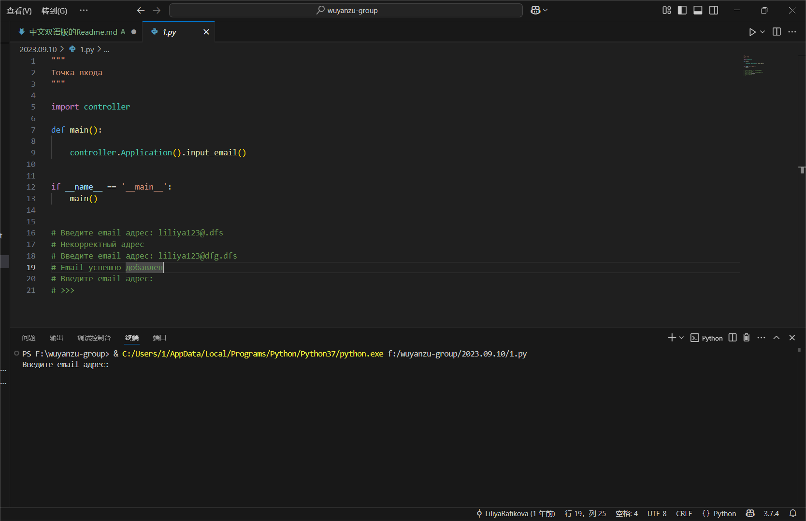


2.显示验证结果
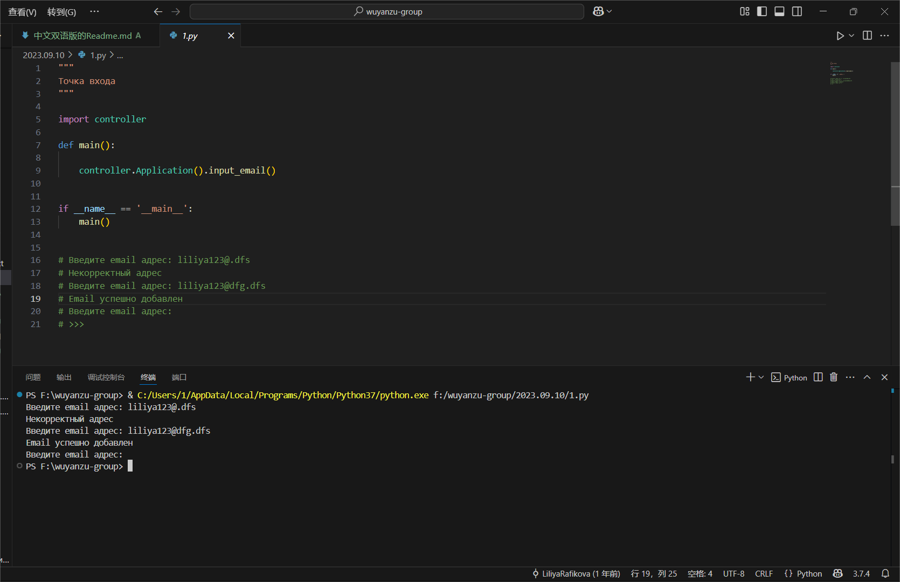

---
<!--2023.09.10文件 by 刘兴发 -->


<!--2023.10.15文件 by 刘兴发 -->
<!--2023.10.15文件 #HW2023.10.15.1 by 刘兴发 -->
# 数据库安装与配置指南
## 安装软件
对于 Windows 操作系统，下载 MySQL Installer 安装包：
[MySQL :: Download MySQL Installer](https://dev.mysql.com/downloads/installer/) 

运行 MySQL Installer 安装包。
按照发送的视频教程中的建议执行安装和配置组件。

对于其他操作系统，下载单独的组件：
[MySQL :: MySQL Community Downloads](https://dev.mysql.com/downloads/) 

- MySQL Community Server
- MySQL Shell
- MySQL Workbench

根据您的操作系统要求安装组件。安装说明：
[MySQL :: MySQL 8.0 Reference Manual :: 2 Installing MySQL](https://dev.mysql.com/doc/refman/8.0/en/installing.html) 

配置选项也在视频教程中进行了说明。

为了测试功能，在 MySQL Shell 客户端应用程序中依次执行以下命令（如果更改了端口号，请替换为您自己的端口号）：
```sql

\connect root@localhost:3306
\sql
show databases;

```

执行屏幕截图：
    任务管理器窗口，突出显示本地 MySQL 服务器服务
    执行了命令的 MySQL Shell 窗口（应显示所有命令的输出）
    已登录到本地服务器连接的 MySQL Workbench 窗口（应显示导航面板、编辑器窗口等）
========================
将屏幕截图放置在当前仓库目录中，以 JPG 或 PNG 文件的形式，文件名分别为 1.1、1.2 和 1.3。
<!--2023.10.15文件 #HW2023.10.15.1 by 刘兴发 -->


<!--2023.10.15文件 #HW2023.10.15.2 by 刘兴发 -->
# 音乐收藏库管理系统

一个用于管理音乐收藏的数据库系统，支持艺术家、音乐合集、歌曲、风格和发行商的信息管理。

## ✨ 项目特点

- 🎵 管理艺术家信息
- 📀 管理音乐合集信息
- 🎶 管理歌曲信息
- 🎭 管理音乐风格
- 🌐 管理发行商信息
- 📐 数据库设计与建模

## 🚀 快速开始

### 1. 安装 MySQL

- **Windows**：下载并安装 MySQL Installer：
  [MySQL :: Download MySQL Installer](https://dev.mysql.com/downloads/installer/)
- **其他操作系统**：下载并安装 MySQL 社区版：
  [MySQL :: MySQL Community Downloads](https://dev.mysql.com/downloads/)

### 2. 创建数据库和表

运行以下 SQL 脚本创建数据库和表：

```sql
-- 创建数据库
CREATE DATABASE mus_library;

-- 使用数据库
USE mus_library;

-- 创建表
create table styles (
    id tinyint unsigned primary key auto_increment,
    style varchar(50) not null unique
);

create table performers (
    id smallint unsigned primary key auto_increment,
    performer varchar(100) not null unique
);

create table publishers (
    id smallint unsigned primary key auto_increment,
    publisher varchar(100) not null unique,
    country varchar(50) not null
);

create table collections (
    id smallint unsigned primary key auto_increment,
    collection varchar(100) not null unique,
    performer_id smallint unsigned not null,
    `date` year,
    style_id tinyint unsigned not null,
    publisher_id smallint unsigned not null,
    foreign key (performer_id) references performers (id),
    foreign key (style_id) references styles (id)  ,
    foreign key (publisher_id) references publishers (id)
);

create table songs (
    id int unsigned primary key auto_increment,
    song varchar(100) not null,
    performer_id smallint unsigned not null,
    collection_id smallint unsigned not null,
    style_id tinyint unsigned not null,
    duration time not null,
    foreign key (performer_id) references performers (id),
    foreign key (collection_id) references collections (id),
    foreign key (style_id) references styles (id)
);

```

3. 数据库建模
使用数据库建模工具（如 MySQL Workbench 或 dbdiagram.io）构建数据库图表，并保存为 JPG 或 PNG 格式的图像文件，文件名为 2.1。

4. 保存 SQL 脚本
将上述 SQL 脚本保存到名为 2.2.sql 的文件中。

## 📦 项目结构

mus_library/
├── 2.1.png          # 数据库图表
├── 2.2.sql          # SQL 脚本
└── README.md

## 📮 项目主要功能说明与截图
1. 数据库图表
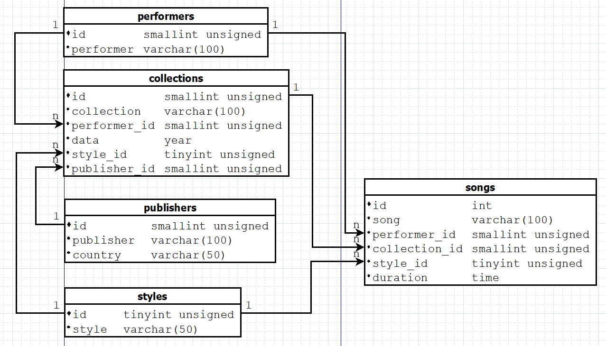

2. SQL 脚本
保存为 2.2.sql 文件。
## 📝 项目说明
数据库图表：使用 dbdiagram.io 或 MySQL Workbench 创建。
SQL 脚本：包含创建数据库和表的 DDL 查询。
<!--2023.10.15文件 #HW2023.10.15.2 by 刘兴发 -->

<!-- by 裴河权 -->

## 📮 项目主要功能说明与截图

### 2023.08.27/文件下的任务、功能及使用方法：  
1. **文件系统管理 - 文件和文件夹**
    *功能：*   
    - 该文件包含 File 类和 Folder 类，用于模拟文件和文件夹的管理操作。
    - File 类表示一个文件，包含获取文件扩展名、路径等功能。
    - Folder 类表示文件夹，支持添加文件和列出文件夹中的内容。

    *参数：*   
    - File 类：
      name：文件名（字符串类型）。
      dir：文件所在目录路径（字符串类型）。
    - Folder 类：
      elements：文件夹中包含的文件或文件夹列表（列表类型）。

    *返回值：*
    - File 类：
      extension()：返回文件的扩展名（字符串类型）。
      ls()：返回文件的完整路径（字符串类型）。
    - Folder 类：
      ls()：返回文件夹中所有文件和文件夹的路径列表（列表类型）。

    *测试方法如下：*  
    ```python
    file1 = File(name="example.txt", dir="C:/Documents")
    print(file1.extension())  # 输出：txt
    print(file1.ls())         # 输出：C:/Documents/example.txt
    
    folder = Folder([file1])
    folder.add_elements(File(name="example2.txt", dir="C:/Documents"))
    for obj in folder:
    print(obj.ls())  # 输出文件夹中的所有文件路径
    ```
    *测试结果：*  
        txt
    C:/Documents/example.txt
    C:/Documents/example.txt
    C:/Documents/example2.txt

2. **随机数据生成与命令操作**
   *功能：*   
    - 生成随机字符串和随机数字的测试数据，并支持命令执行、撤销和重做功能。

    *参数：*   
    - TestCase 类：
      messages：随机生成的消息字符串列表。
      numbers：包含随机数字的列表，长度为 4 至 6 个数字。
    - TestCommand 类：
      operation：操作类型（如打印消息或数字）。
      account：执行操作的测试账户对象。

    *返回值：*
    - TestCase 类：无返回值，仅用于生成数据。
    - TestCommand 类：
      execute()：执行指定的操作。
      undo()：撤销上一个操作。
      re_undo()：重做上一个撤销的操作。

    *测试方法如下：*  
    ```python
    test = TestCase()
    c1 = TestCommand(test, Operation.PRINT_MSG)
    c1.execute()  # 执行打印消息操作
    c1.undo()     # 撤销操作
    c1.re_undo()  # 重做操作
    ```
    *测试结果：*  
    执行操作：打印消息
    撤销操作：打印消息
    重做操作：打印消息

3. **ClassBuilder-动态类构建器**
   *功能：*   
    - 动态生成 Python 类，并允许添加实例属性和类级属性。

    *参数：*   
    - class_name：类的名称（字符串类型）。
    - name：属性的名称（字符串类型）。
    - value：属性的值（可以是任意类型）。

    *返回值：*
    - ClassBuilder 类：
      add_inst_attr()：返回自身，支持链式调用。
      add_cls_field()：返回自身，支持链式调用。
      __str__()：返回类的字符串表示。

    *测试方法如下：*  
    ```python
    cb = ClassBuilder('Person').add_inst_attr('name', 'Liiya').add_inst_attr('age', 33)
    print(cb)
    ```
    *测试结果：*  
    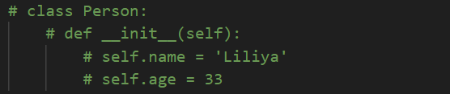  

4. **HTMLTag 构建器**
   *功能：*   
    - 用于生成 HTML 标签，支持嵌套标签和兄弟标签。

    *参数：*   
    - name：标签的名称（字符串类型，如 div、p）。
    - value：标签的内容或属性（字符串类型）。
    - style：标签的样式（字符串类型）。

    *返回值：*
    - 返回 HTMLTag 对象，用于链式调用构建标签。

    *测试方法如下：*  
    ```python
    root = HTMLBuilder('div')
    div = HTMLTag.create('div', '500px', '500px')
    div.sibling('p', 'Menu').nested('ul')
        .sibling('li', 'File').sibling('li', 'Edit')
    div.build()
    ```
    *测试结果：*  
    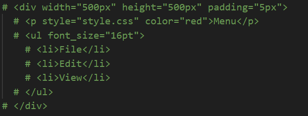

5. **简历生成器(CVBuilder)**
   *功能：*   
    - 用于生成个人简历的 HTML 内容。

    *参数：*   
    - name：个人名字（字符串类型）。
    - age：个人年龄（整数类型）。
    - field_of_employment：就业领域（字符串类型）。

    *返回值：*
    - 返回生成的 HTML 简历代码（字符串类型）。

    *测试方法如下：*  
    ```python
    cv = CVBuilder('Liliya Martynova', 33, 'Web Developer')
    cv.add_education('University of Python', 'Developer', '2022')
    cv.add_project('Portfolio', 'portfolio.com')
    cv.build()
    ```
    *测试结果：*  
    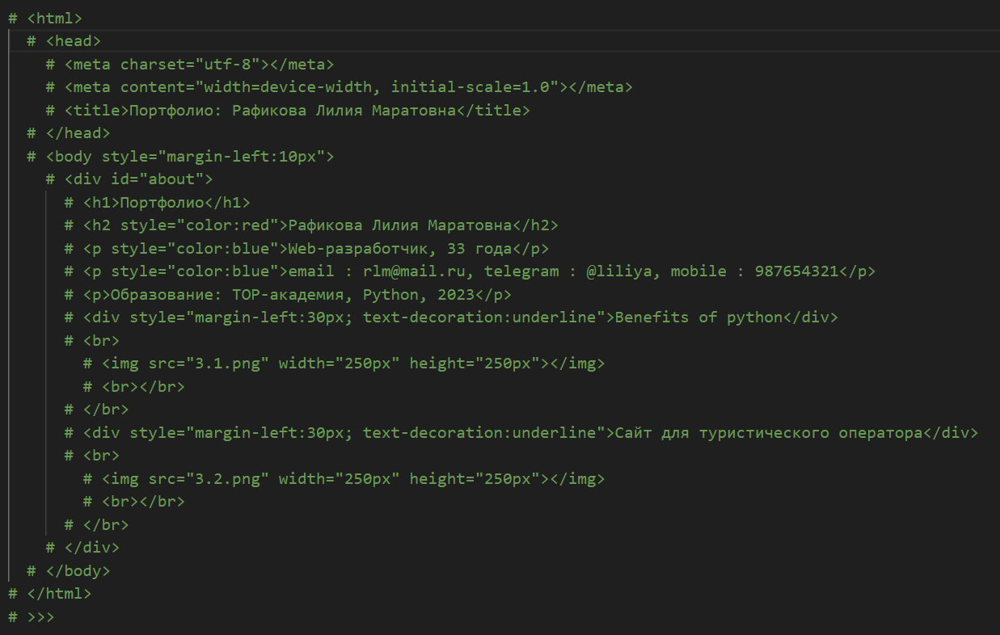

6. **操作命令和日志-操作执行与撤销**
   *功能：*   
    - 执行、撤销和重做操作，支持操作记录。

    *参数：*   
    - TestCommand 类：
      operation：操作类型（如打印消息或数字）。
      account：执行操作的对象（TestCase）。

    *返回值：*
    - TestCommand 类：
      execute()：执行命令。
      undo()：撤销命令。
      re_undo()：重做命令。

    *测试方法如下：*  
    ```python
    test = TestCase()
    c1 = TestCommand(test, Operation.PRINT_MSG)
    c1.execute()  # 执行打印消息操作
    c1.undo()     # 撤销操作
    c1.re_undo()  # 重做操作
    ```
    *测试结果：*  
    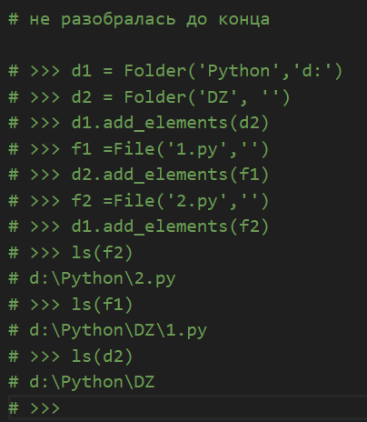

7. **文件系统管理-文件和文件夹**
   *功能：*   
    - 模拟文件系统操作，包括获取文件扩展名、列出文件路径、文件夹内容等。

    *参数：*   
    - name：文件或文件夹的名称（字符串类型）。
    - dir_path：文件或文件夹所在的路径（字符串类型）。

    *返回值：*
    - File 类：
      extension()：返回文件的扩展名（字符串类型）。
      ls()：返回文件的路径（字符串类型）。
    - Folder 类：
      ls()：列出文件夹中的内容（列表类型）。

    *测试方法如下：*  
    ```python
    file1 = File(name="example.txt", dir="C:/Documents")
    print(file1.extension())  # 输出：txt
    print(file1.ls())         # 输出：C:/Documents/example.txt
   
    folder = Folder([file1])
    folder.add_elements(File(name="example2.txt", dir="C:/Documents"))
    for obj in folder:
        print(obj.ls())  # 输出文件夹中的所有文件路径
    ```
    *测试结果：*  
    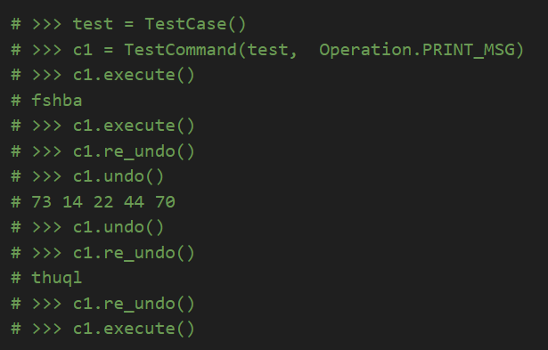
   <!-- by 裴河权 -->

<!-- by 钟章鸿 -->
## 📮 项目主要功能说明与截图
### 2023.07.02/文件下的任务、功能及使用方法：

1. **编写Tetrahedron类**

    *功能:*
        描述一个正四面体（所有面都是等边三角形）的几何属性，并提供计算其表面积和体积的方法。

    *参数:*
        - 参数1: 边长,类型为 float。

    *方法:*
        - surface() 功能:计算正四面体的表面积，返回值为浮点数。
        - volume() 功能:计算正四面体的体积，返回值为浮点数。

    *测试方法与结果:*
        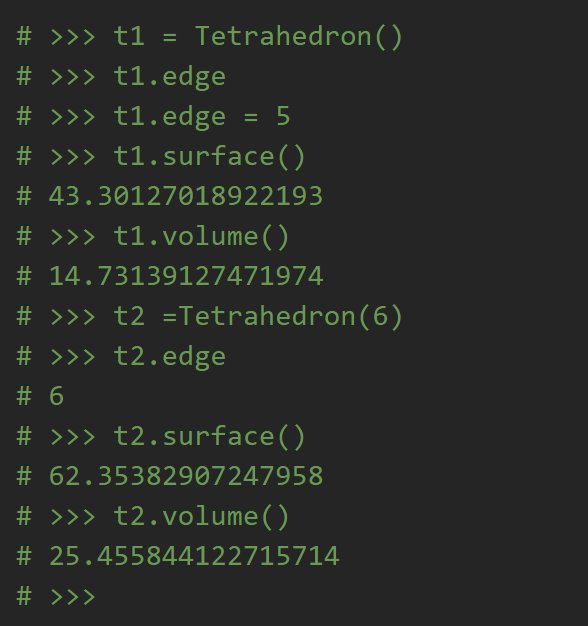

2. **编写PowerMeter类**

    *功能:*
        模拟一个双费率电表（即根据时间段不同，电费单价不同）。

    *参数:*
        tariff1：费率 1 的单价（默认值为 4.35）。
        tariff2：费率 2 的单价（默认值为 3.21）。
        tariff2_starts：费率 2 开始的时间（默认值为晚上 23:00）。
        tariff2_ends：费率 2 结束的时间（默认值为早上 7:00）。

    *方法:*
        - __repr__()：
            功能:返回电表对象的字符串表示形式，显示累计用电量（单位为千瓦时）。
        - __str__()：
            功能:返回电表对象的字符串表示形式，显示当前月份和当天的累计电费。
        - meter()：
            功能:接收一个用电量（power），计算其对应的电费，并更新电表的状态。返回本次用电量的电费（Decimal 类型）。

    *测试方法:*
        ```python
            pm1 = PowerMeter()
            pm1.meter(5)
        ```

    *测试结果:*
        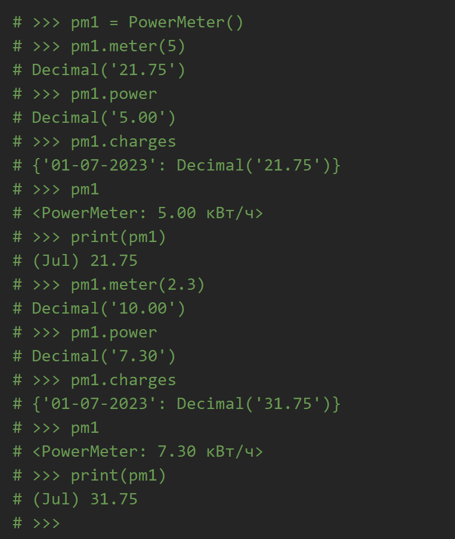

3. **编写ChessKing类**

    *功能:*
        描述国际象棋中的国王棋子（King）的行为和规则

    *方法:*
    - __repr__():
        功能:返回国王棋子的字符串表示形式，用于调试。

    - __str__(): 
        功能:返回国王棋子的字符串表示形式，用于打印。

    - is_turn_valid() 
        参数: new_square：目标格子。
        功能: 检查从当前格子移动到目标格子是否符合国王的规则。如果移动合法，返回 True；否则返回 False.

    - turn()：
        参数：new_square：目标格子。
        功能: 执行从当前格子到目标格子的移动。

    *测试方法与结果:*
        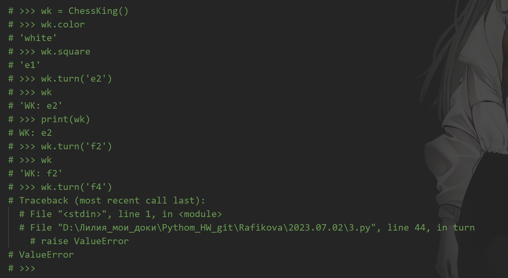

4. **编写CountableNouns类**
    *功能:*
        处理俄语中与数字匹配的可数名词的形式变化。俄语中的名词会根据数字的不同而变化。

    *方法:*
        pick():
            参数：
            number：数字，用于确定名词的形式。
            word：名词的基本形式
            功能:
            根据输入的数字和名词，返回名词的正确形式。

        save_words();
            参数：
            word1：名词的基本形式。如果未提供，则提示用户输入。
            功能:通过交互式输入，向 words 字典和 words.csv 文件中添加新的名词及其变化形式。
    
    *测试方法与结果:*
        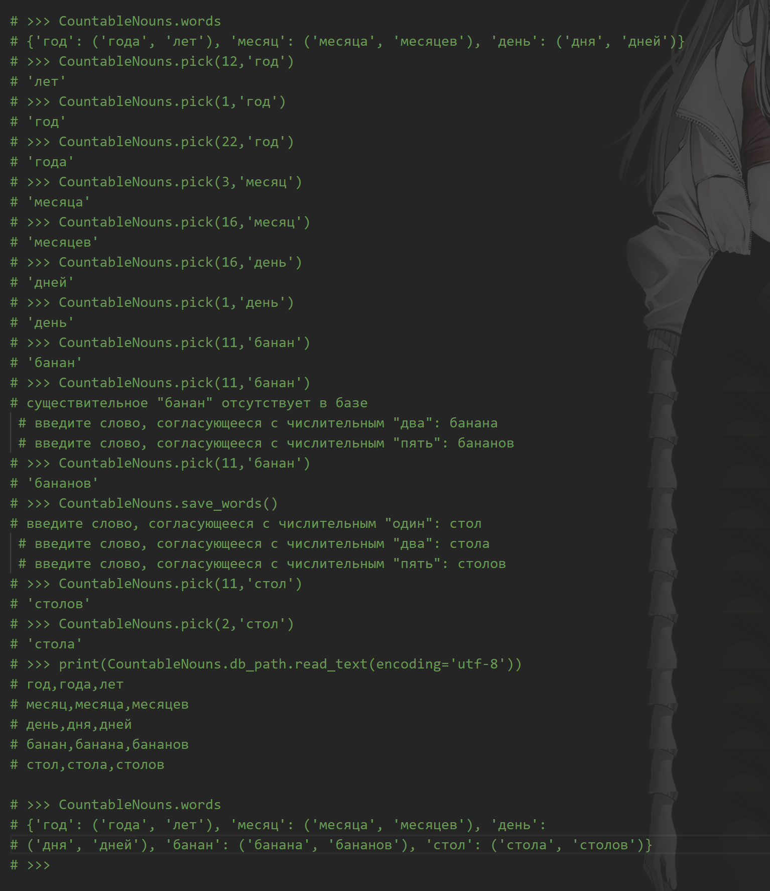

### 2023.07.30/文件下的任务、功能及使用方法：

1. **编写Point、Line、Polygon类**
    Point类:
        功能:
            - 存储点的坐标（x 和 y）。
            - 提供点的只读属性。
            - 支持点的比较和字符串表示。
        参数：
            x float, y: float
        返回值为点的字符串表示形式

        方法：
            __eq__():
                功能：比较两个点是否相等（x 和 y 坐标都相等）
            __str__ ()和 __repr__():
                功能：返回点的字符串表示形式
    Line类：
        功能：
            表示一个线段，由两个点（起点和终点）定义，支持计算长度和动态更新起点或终点。
        
        参数：
            起点：start 类型：Point
            终点：end   类型：Point
        返回值为线段的字符串表示形式
        方法：
            length_calc():
                功能：计算两点之间的距离（即线段的长度）。
            start():
                功能：
                    起点和终点可以动态更新，但只能赋值为 Point 对象，否则抛出 TypeError。
            __str__() 和 __repr__():
                功能：返回线段的字符串表示形式
    Polygon类：
        功能：
            表示一个多边形，由多个线段组成，支持检查多边形是否闭合以及计算周长。
        
        参数：边长
        方法：
            is_closed():
                功能：
                检查多边形是否闭合：
                    首尾线段是否相连。
                    每条线段的终点是否与下一条线段的起点相连。
            perimeter():
                功能:
                    计算多边形的周长（所有线段长度之和）。
                    如果多边形未闭合，抛出 ValueError。
    *测试方法与结果:*
        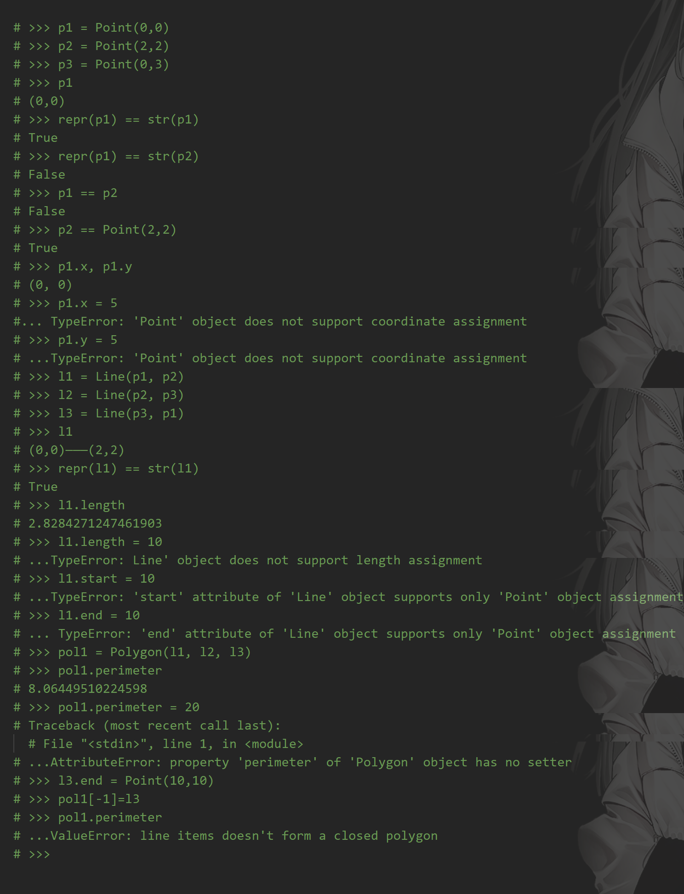
    <!-- by 钟章鸿 -->

### 目录“`2023.04.23`”中程序的主要功能和截图

- 1.py


这个程序用于记录用户输入的能被7整除的数，然后将这些数逆序输出。要使用这个程序，我们需要输入能被7整除的数字。当输入一个不能被7整除的数字时，程序将按用户输入的能被7整除的数字的倒序输出，并结束程序

- 2.py


这个程序用于计算输入的正数之和。如果我们想要使用这个程序，我们需要输入待输入的数字总数，然后按顺序输入整数。输入后，程序将给出用户输入的数字中正数的和

- 3.py


这个程序用于计算一个数的所有除数之和。使用这个程序时输入一个正整数，然后程序将输出该数的所有除数之和

- 4.py


这个程序用于计算指定位数中质数的总数。使用这个程序时需要用户输入一个整数，表示要处理的数字位数（如3代表三位数），然后程序会输出一个整数，表示位数范围内有多少个质数。

- 5.py


这个程序用于计算一段文本的总费用。使用这个程序时需要用户输入一段文本，然后程序会输出这段文本的总费用

- 6.py


这个程序用于判断一个六位数的车票是否为“幸运票”（前三位数字之和等于后三位数字之和）。使用这个程序时用户需要输入一个六位数，然后程序会输出‘是’或者‘否’

- 7.py


这个程序用于去除用户输入文本中的所有指定标点符号。使用这个程序时用户需要输入一个字符串，然后程序将输出一个不含指定符号的新字符串

- 8.py


这个程序用于生成指定长度的斐波那契数列。使用这个程序时用户需要输入一个正整数，表示需要输出的斐波那契数列的长度，然后程序会输出一个以空格分隔的斐波那契数列

<!-- by 陈万程-->